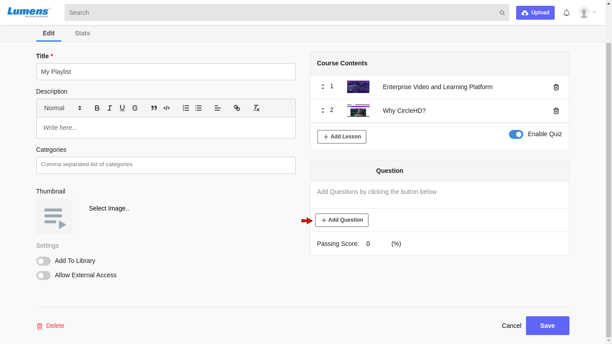
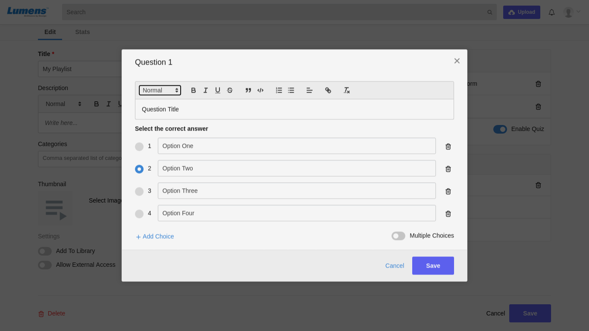
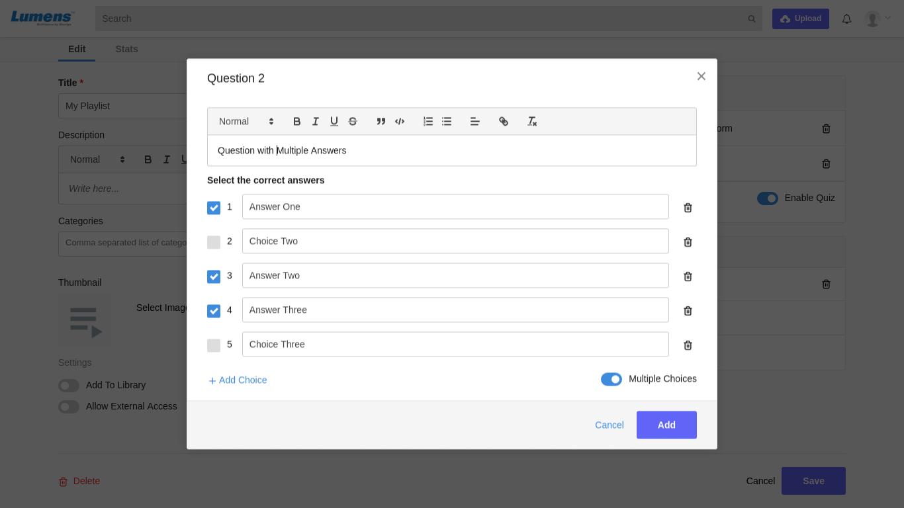
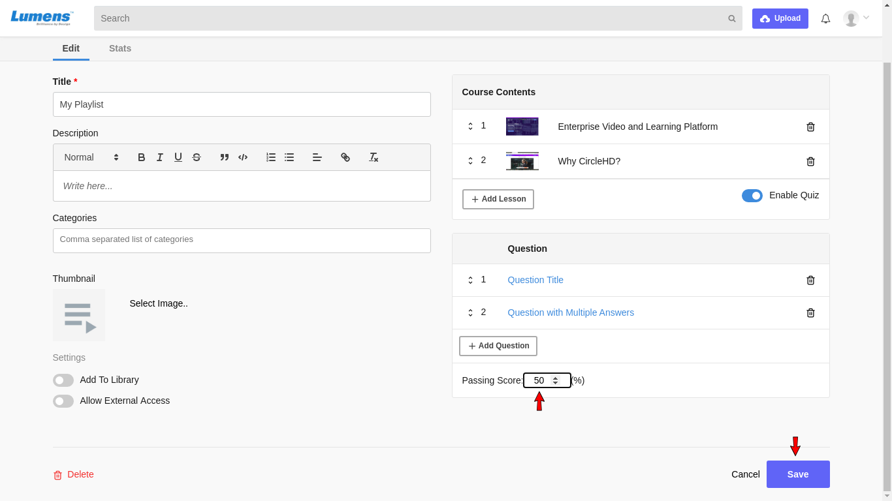

# How to create a quiz in a playlist

**1-** Click on “**Playlists**” in the left vertical menu. This will load all the playlists added in the Library. Click on Manage to see your created playlists.

**2-** Click on the playlist that you want to edit, under “**Your Playlists**”. Click on Edit option.

This will load the Edit Playlist page as below.

**3-** Click on toggle button to enable quiz.

To add a question in your quiz, click on "**Add Question**" button.

**4**- After clicking on "**Add Question**" button, an 'Add Question' form appears. It is an objection question type form. Enter your question title and all the possible options of your question. Now select correct answer and click on Add button to add the question.

Similarly you can add **Question with Multiple Answers.** Enable **"Multiple Choices"** toggle button and select multiple answers for your question.

Click on Add button to add the question.

**5-** Now add a passing score for your quiz. Users who will attempt the quiz must get equal or greater marks than passing score to pass the quiz.

**6-**  You can click “**Save**” once changes are made. 

\*\*\*\*

