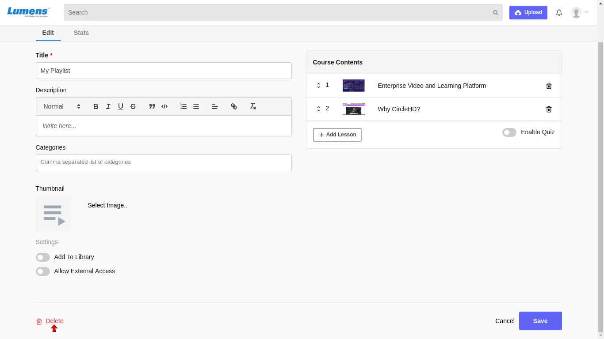

# How to Delete a Playlist?

**1-** Click on “**Playlists**” in the left vertical menu. This will load all the playlists added in the Library. Click on Manage to see your created playlists.

**2-** Click on the playlist that you want to edit, under “**Your Playlists**”. Click on Edit option.

This will load the Edit Playlist page as below.

**3-** On the Playlist edit page, click “**Delete**” button in the bottom to delete the playlist. It will prompt you to confirm if you still need to delete, click “**Yes**” to continue. This will remove the playlist and take you back to the Playlist home page.

