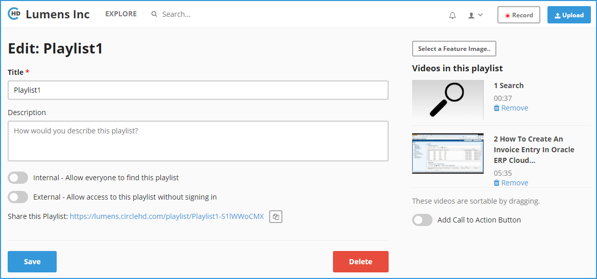

# How to Delete a Playlist?

**1-** Click on “**Playlists**” in the left vertical menu. This will load all of your playlists and also the public playlists.

**2-** Click on the playlist that you want to edit, under “**Your Playlists**”. This will load the Playlists detail page as below.

**3-** Click on “**Edit**’ button in the right, above the Playlist thumbnail list. This will load the Playlist Edit page. 

**4-** On the Playlist edit page, click “**Delete**” button in the bottom to delete the playlist. It will prompt you to confirm if you still need to delete, click “**Yes**” to continue. This will remove the playlist and take you back to the Playlist home page.

