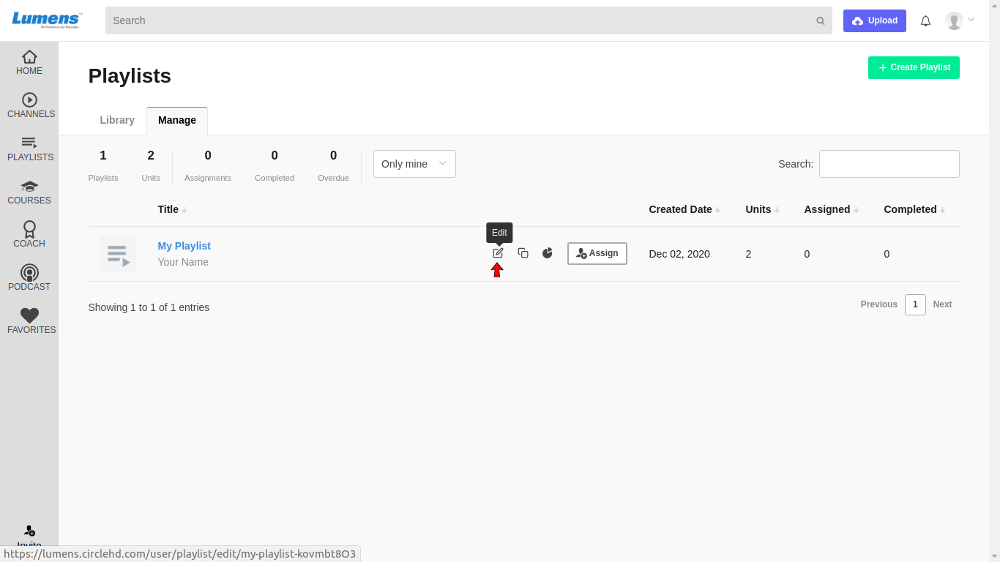

# How to Make a Playlist Public?

**1-** Click on “**Playlists**” in the left vertical menu. This will load all the playlists added in the Library. Click on Manage to see your created playlists.

**2-** Click on the playlist that you want to edit, under “**Your Playlists**”. Click on Edit option.

This will load the Edit Playlist page as below.

**3-** To share your playlist publically, enable option **'Allow External Access'.** You can share url of your playlist with anyone to share the playlist publically.

To copy the url of your playlist, click here.

**4-** You can click “**Save**” once changes are made.

