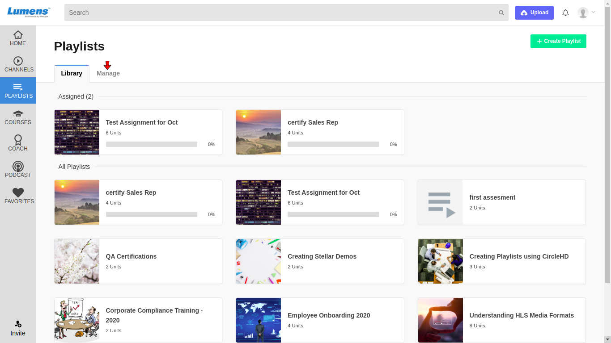

# How to see playlist statistics.

**1-** Click on “**Playlists**” in the left vertical menu. This will load all the playlists added in the Library. Click on Manage to see your created playlists.

Here you can see all the statistics about your created playlists.

1. **Playlists -** It shows count of playlists created by you.
2. **Units** - It shows count of total videos added in all the playlists.
3. **Assignments -** It shows count of total assigned users.
4. **Completed -** Count of total users who completed the playlists.
5. **Overdue** - Count of playlists with passed due date yet incomplete.
6. **Units** - Count of videos added in individual playlist.
7. **Assigned** - Count of assigned users of individual playlist.
8. **Completed -** Count of users who completed the individual playlist

\*\*\*\*

