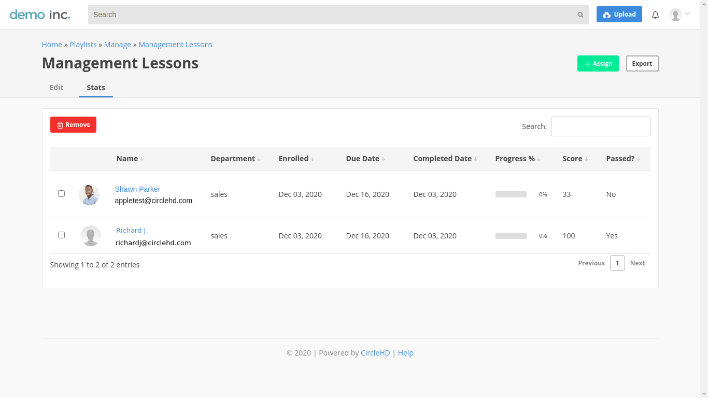

# How to see the quiz statistics

**1-** After creating a playlist with quiz, open "Manage" page of Playlists.

**2-**  Click on "**stats"** option to see the list of assigned users.

**3- Stats** page shows the complete statistics of assigned playlists.

1. **Department** - It is name of the department of a user.
2. **Enrolled** - Date when playlist was assigned to a user.
3. **Due Date** - Playlist due date.
4. **Completed** **Date** - Date when when playlist was completed.
5. **Progress** **%** - It shows the percentage based on total number of the videos watched in a playlist.
6. **Score** - Individual quiz score of an assigned user.
7. **Passed** - Quiz Result - Passed or Failed.

