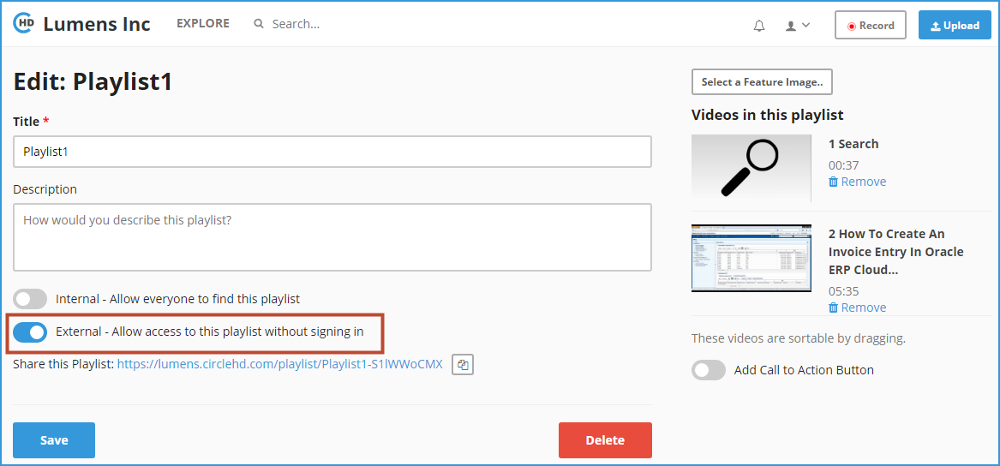

# How to Share Your Playlist to External Users/Customers?

**1-** Click on “**Playlists**” in the left vertical menu. This will load all of your playlists and also the public playlists.

**2-** Click on the playlist that you want to edit, under “**Your Playlists**”. This will load the Playlists detail page as below.

**3-** Click on “**Edit**’ button in the right, above the Playlist thumbnail list. This will load the Playlist Edit page. 

**4-** On the Playlist edit page, you can enable the “**External**” option in the left. 

**5-** There will be a share link displayed below the “**External**” option, you can copy the link to clipboard by clicking copy icon on the right. 

**6-** Click “**Save**” once changes are made. This will update the changes and take you back to the Playlist detail page. 

**7-** Once you are on the playlist detail page, copy the URL in the browser, this will be playlist URL that you can share with any external user / client. They don’t need to login to CircleHD portal to view the playlist. Note that this will make the entire Playlist publicly accessible.

