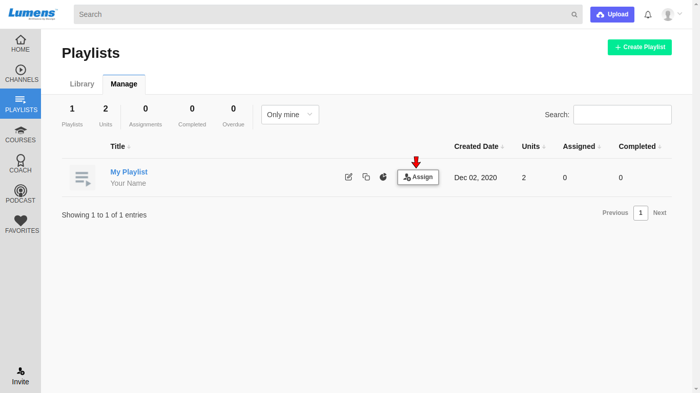
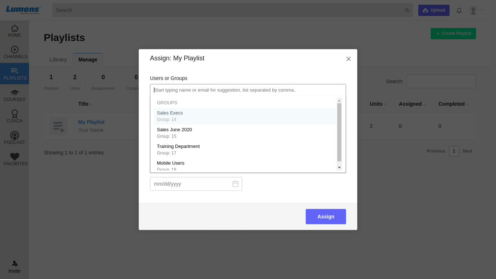
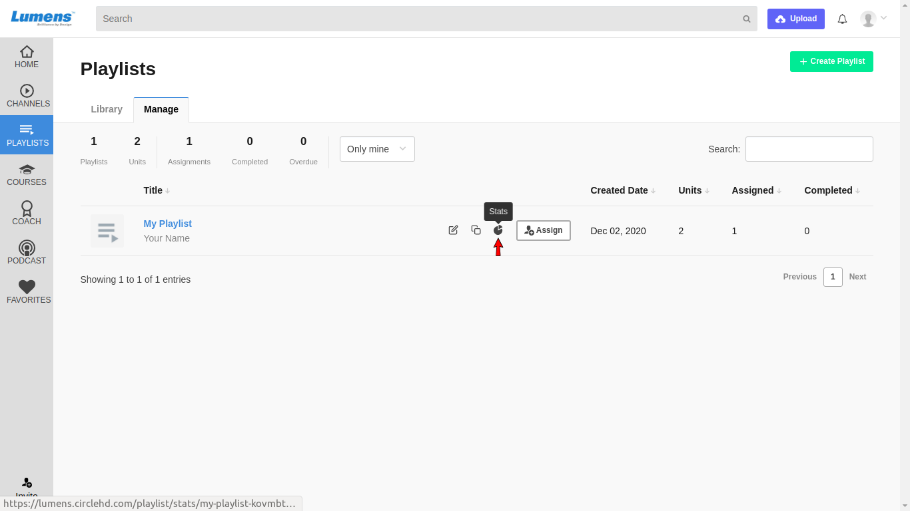
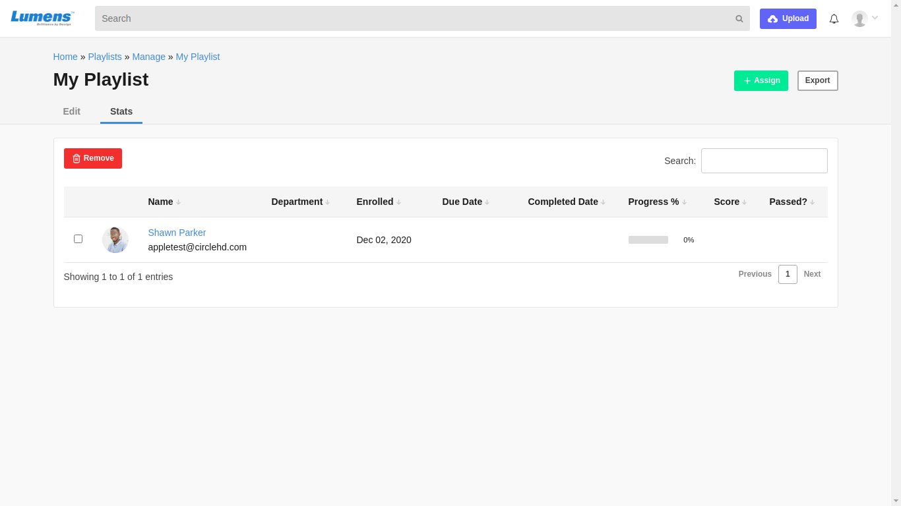

# How to Share Your Playlist ?

**1-** Click on “**Playlists**” in the left vertical menu. This will load all the playlists added in the Library. Click on Manage to see your created playlists.

**2-** Click on the playlist that you want to edit, under “**Your Playlists**”. Click on Assign option.

**3-** **"Assign My Playlist"**  form will be opened. Add users or groups to assign the playlist. Click on the assign button to assign the playlist.

**4-** Click on "**stats"** option to see the list of assigned users.

**5-** Now assigned users is able to see your playlist.

