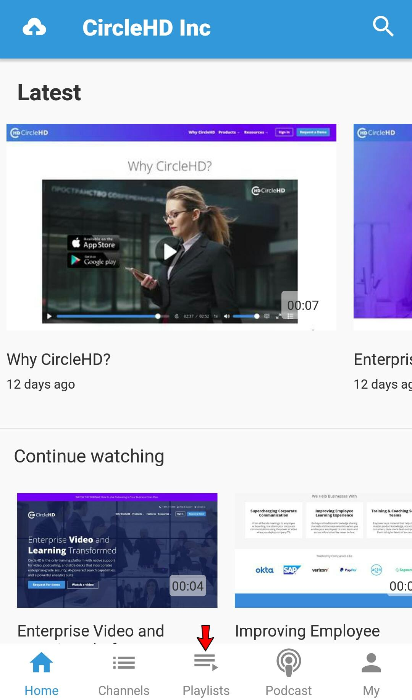
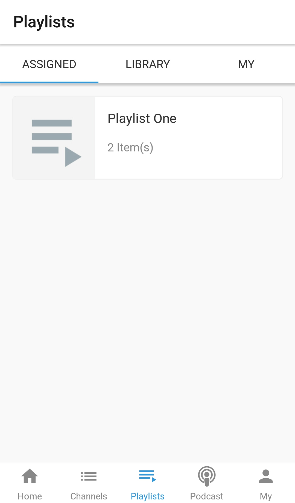
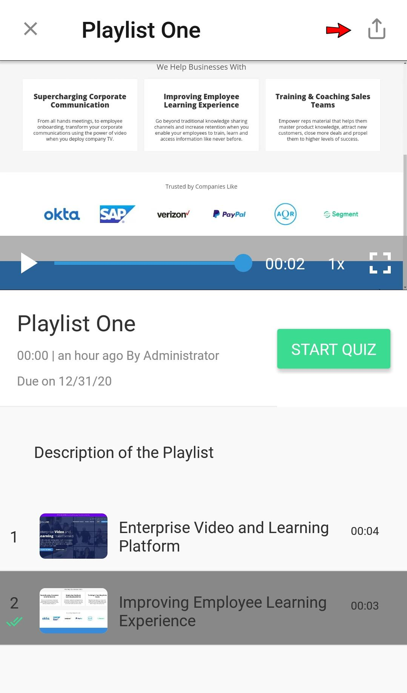

# How to Share Your Playlist ?

**1-** Click on “**Playlists**” in the left vertical menu. This will load all the playlists added in the Library. Click on Manage to see your created playlists.

**2-** Click on the playlist that you want to edit, under “**Your Playlists**”. Click on Assign option.

**3-** **"Assign My Playlist"**  form will be opened. Add users or groups to assign the playlist. Click on the assign button to assign the playlist.

**4-** Click on "**stats"** option to see the list of assigned users.

**5-** Now assigned users is able to see your playlist.

### Mobile

**1-** Open the Playlist from the bottom horizontal menu.

**2-** There are three tabs visible. Assigned, Library and My

Assigned shows the list of all the Playlists which are assigned to the logged in user. Library shows the list of playlists which are global and My shows the list of playlists which are created by logged in user.

**3-** Once user opens a playlist, there is a share icon at top right of the screen. User can share playlist url on different social platforms using the icon.

Externaly Shared Playlist's Content can be seen by users without logging into the application. If playlist is not externally shared then user needs to log into the application to see the content.

\*\*\*\*

