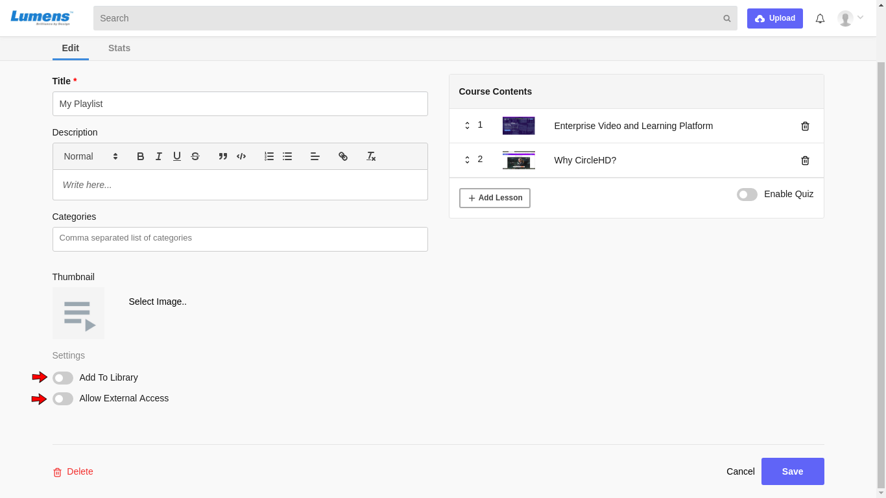

# How to Share Your Playlist to External Users/Customers?

**1-** Click on “**Playlists**” in the left vertical menu. This will load all the playlists added in the Library. Click on Manage to see your created playlists.

**2-** Click on the playlist that you want to edit, under “**Your Playlists**”. Click on Edit option.

This will load the Edit Playlist page as below.

**3 -** To add your playlist in the Library, you can enable option **'Add to Library'** and if you want to share your playlist with non-registered users, enable option **'Allow External Access'.** You can share url of your playlist with anyone to share the playlist content with them.

Non registered user can not see the quiz added in your playlist.

**4-** On the Playlist edit page, you can edit “**Title**”, “**Description**”, **Categories**,  **thumbnail** for the playlist, **change order** of videos within the playlist, **remove videos** from the playlist and **quiz.**

**5-** You can click “**Save**” once changes are made. This will take you back to the Playlist detail page**.**

