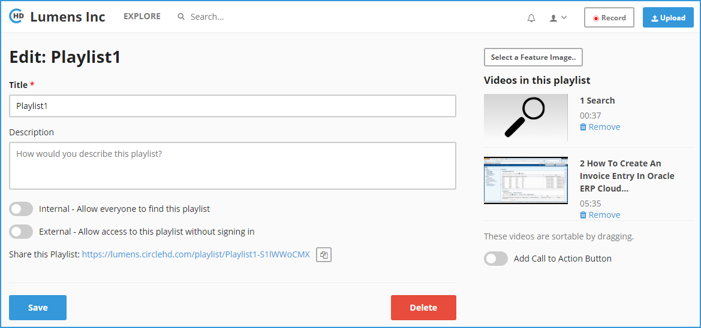

# How to Share Your Playlists?

**1-** Click on “**Playlists**” in the left vertical menu. This will load all of your playlists and the public playlists.

**2-** Click on the playlist that you want to edit, under “**Your Playlists**”. This will load the Playlists detail page as below.

**3-** If you want to auto play the videos in the playlists videos automatically in the order arranged, then you can enable “**Auto play**” option in the right. 

**4-** To edit details on the playlist, you can click “**Edit**’ button in the right, above the Playlist thumbnail list. This will load the Playlist Edit page.

**5-** On the Playlist edit page, you can edit “**Title**”, “**Description**”, change **security settings**, add **thumbnail** for the playlist, **change order** of videos within the playlist, **remove videos** from the playlist, **add a call to action button** on the playlist detail page and delete the playlist completely. 

**6-** You can click “**Save**” once changes are made. This will take you back to the Playlist detail page as shown below. 

**7-** The call to action button and description will be displayed on the right of the video screen under thumbnails.

