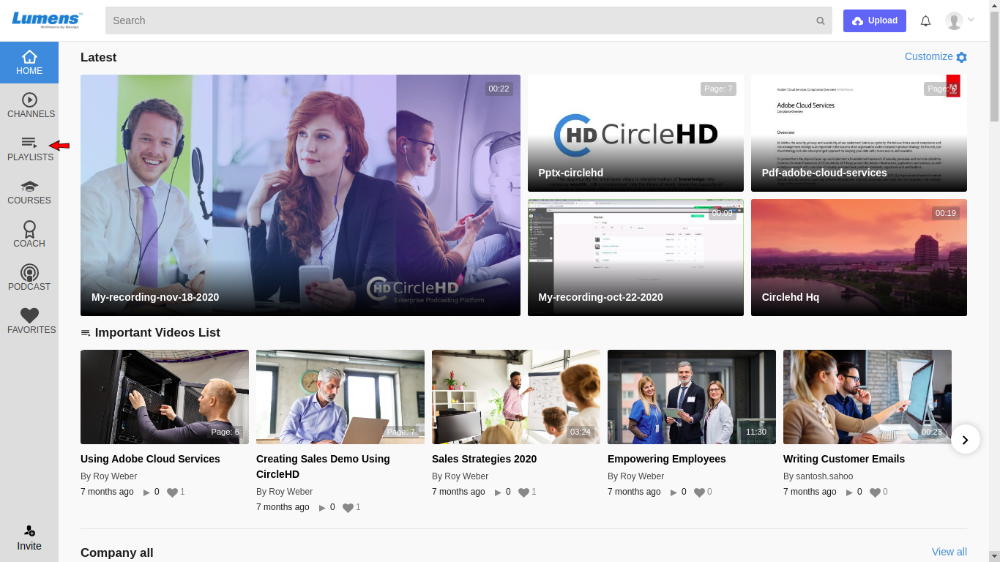
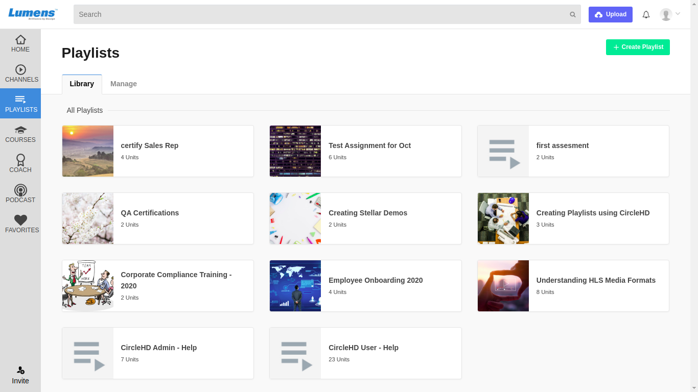
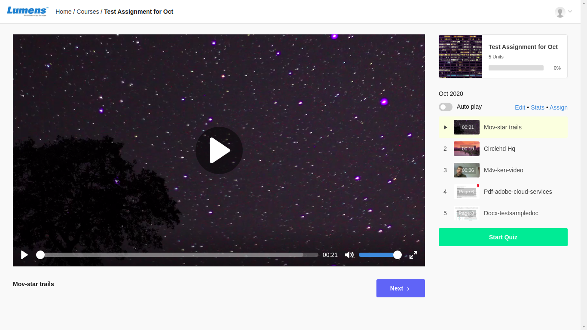

# What is The Playlist?

Playlists are personalized groups that any user can create to group using one or more video\(s\). The videos can be the ones they have uploaded or the ones they have access to. 

This gives user an option to create a user friendly sequential series videos grouped together, that can be effectively used for knowledge transfer or informal training purpose. It empowers employees to design a custom series that could work for them in learning and can also share internally or externally the same series. 

To view your created and accessible playlists, click on the “**Playlists**” link in the left vertical menu.

This will load all playlists created by you under “**Your Playlists**”, and the Playlists that are shared and visible by other CircleHD Portal users under “**Public Playlists**”.

You can click on the individual Playlist that you need to view. Below is an example of the Playlist detail page. It will list the videos added in the playlist in the right.

Apart from videos a quiz can be created in the Playlist. A quiz is a set of optional questions. Users can attempt the quiz and check their score based on the correct answers.

