# How to Create / Update / Delete a Show?

**1-** To open Podcast Manager page, click on top right menu, select \[**Podcast manager**\] option in the drop-down menu.

**2-** Click on 'New Show' button on the Shows page.

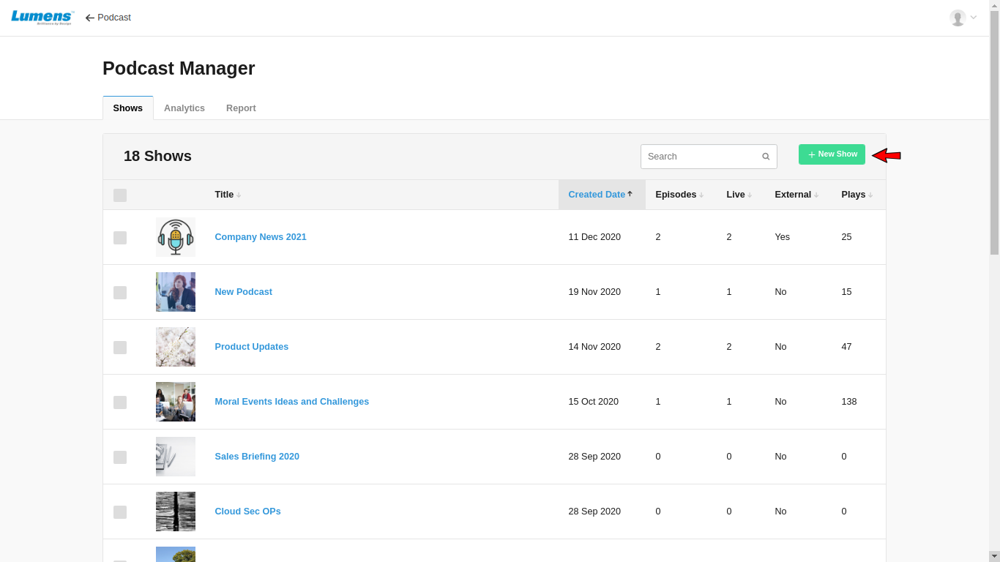

**3-** It opens 'Create Show' form.

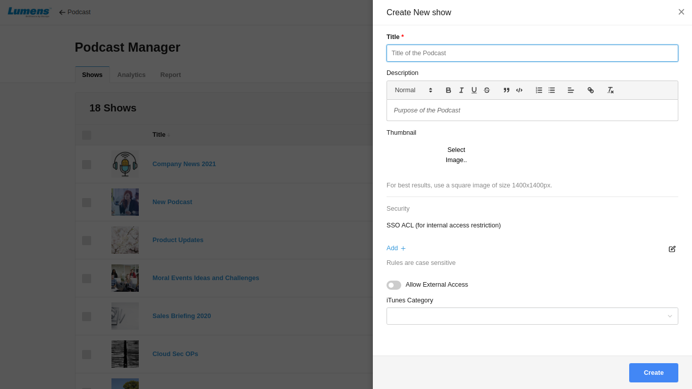

a\) **Title**  - Title of the Show

b\) **Draft Mode-** Enabling draft mode, show will be in draft

c\) **Description** - Details about Show

d\) **Thumbnail** - Upload Image for a show

e\) **ACL based Security \(SSO\)** 

i\) **Add SSO ACL**  
Adding an ACL \(access control lists\) will allow users to be added based on their SSO attributes stored by the enterprise SSO. Only privileged user will be able to browse the show.

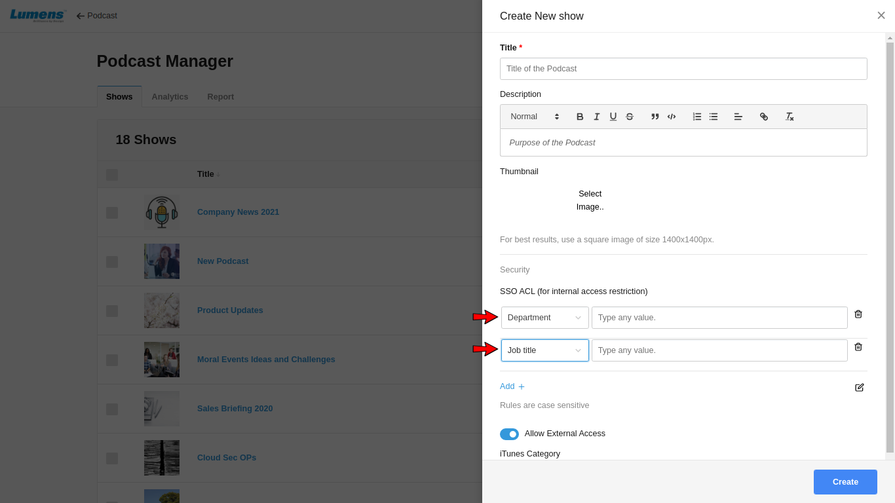

Adding Department will give permissions to the users of the department to watch a show. Other attributes like 'Job Title' , Manager, Cost Center, etc. will provide permission of the show to the users accordingly.

ii\) **Delete SSO ACL**  
User can delete unwanted ACL using delete icon.

iii\) **Edit ACL Query**  
Click on edit icon to edit ACL query 

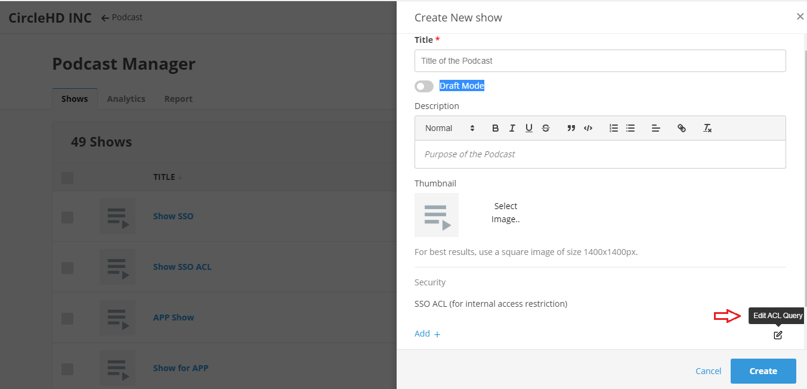

When click on edit ACL Query icon then it opens pop-up to add ACL query

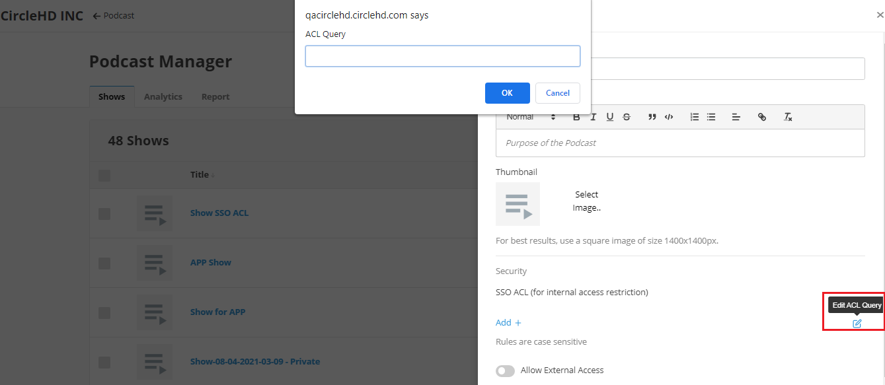

f\) **Allow External Access -** It allows to share the link of the show with non registered users or external users outside of your organization. This way the episodes and shows can be shared with users who are not in the system as the shared link will  not need authentication.

g\) **i-tunes category** - User can select categories for show. If a show is created for education purpose or entertainment purpose, related category can be selected for the show.

Click on Create button to create a show.

### Update Details of an Existing Show

**1-** Click on Edit icon of the show to update the details.

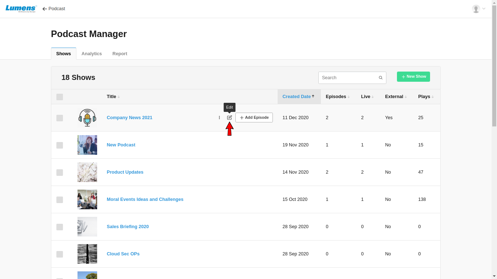

**2-** It opens Edit Show form.

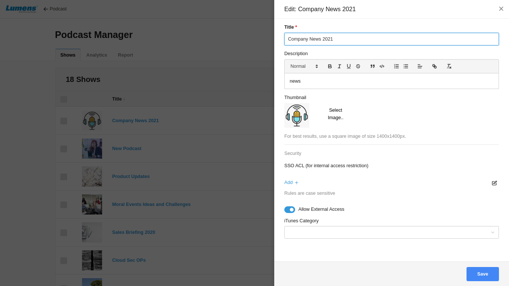

**3-** Here user can update Title, Description, Thumbnail image, ACL rules, External Access and itunes-category. User can remove existing ACL rules and add new one.

Now user needs to click on Save button to save the changes.

### Delete a Show

**1-** Open Shows page and select one or multiple shows which you want to delete.

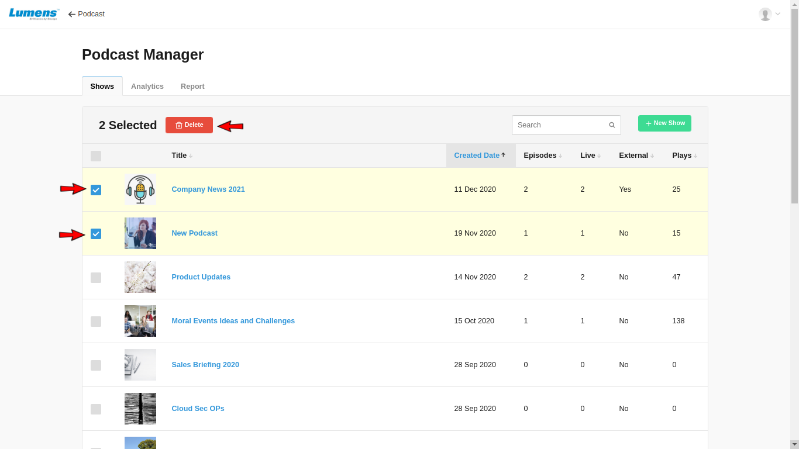

**2-** Delete button starts appearing above the show list. Click on Delete button to delete all selected show\(s\).

### Preview Show

**1-** When click on 3 dots, it will show cog dropdown to select Preview, XML RSS Feed, Copy Link and Embed Code

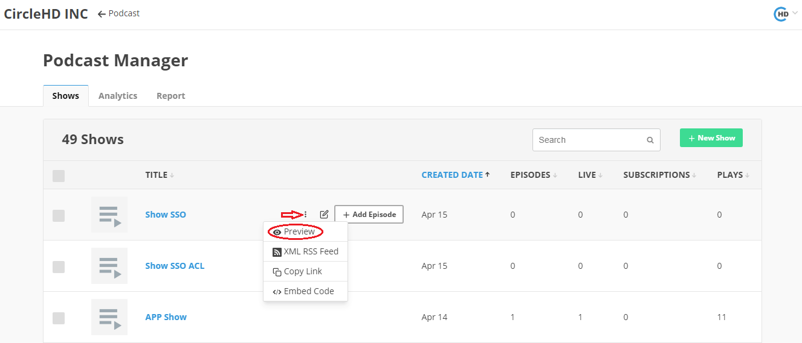

**2-** When click on Preview, it lists all episodes of the show in another tab.

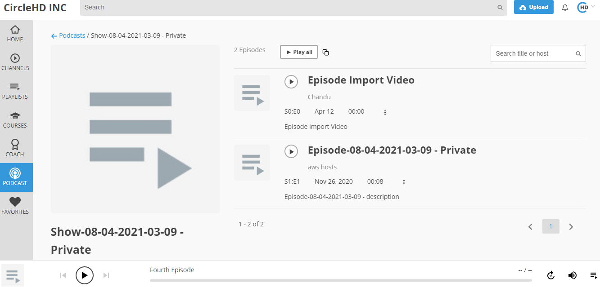

**3-** Click on the play button to listen an episode or click on 'Play All' to play all episodes of the show. It opens audio player in the footer and starts playing your selected episode.

**4-** Search box helps to search an episode within the show. If there are a lot of episodes in the show, it helps users to filter based on titles.

### Embed Code

**1-** Click on embed code link, it will open pop-up to play episode and to copy embed code

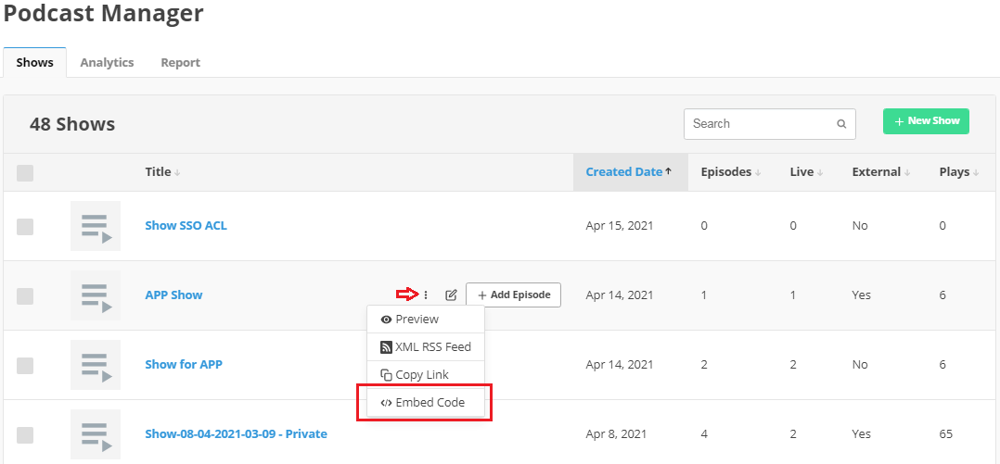

**2-** When click on play icon, episode starts playing.

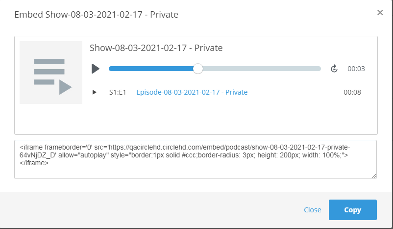

**3-** Click on copy embed code, it copied to clipboard

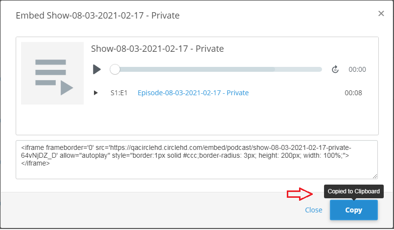

**4-** To close the popup, click on close link

