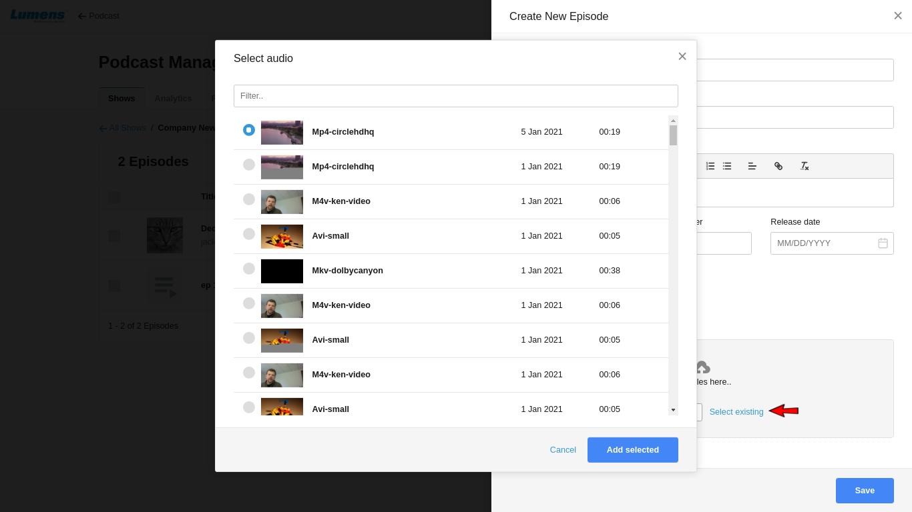

# How to Create / Update / Delete Podcast  Episodes?

Episodes are created under or part of shows. To create an episode, it is necessary to create a show first or you can create an episode under an existing show.

**1-** To open Podcast Manager page, click on the \[**Podcast manager**\] option in the drop-down menu.

**2-**To create an episode for a show, click on 'Add Episode' button next to the show.

or alternatively you can use 'New Episode' option on the show detail page. Click on a show and click on 'New Episode' button.

**3-** Create Episode form will be displayed, enter the details accordingly.

**a- Title** - Title of an episode

**b- Host Name** - Name of the person who is hosting the episode

**c- Description** - Details of the episode

**d- Season** - Season Number of the episode

**e- Episode Number -** Episode Number of the episode

**f- Release date -** It is a date when episode will start appearing at user's end in the Podcast. If the admin adds a Past Date or Today's Date as a Release Date, the episode starts appearing at user's end immediately.

If the admin adds Future Date as a Release Date, the episode will start appearing at user's end on the given date.

**g- Thumbnail** - Upload image for an episode.

**h- Drop Files Here - Choose a file**

Upload an audio file for your episode or you can upload a video file also. The system converts video file as an audio file. One episode can have one audio file only.

or alternatively you can use your uploaded media in the episode. Use 'Select Existing' option

It will open 'Select audio' pop up with all uploaded media. Here user can select a media for the epsidoe. Click on 'Add Selected'. Media will be selected for the episode. You can play it in the player and verify.

**4-** Click on save button to save the episode.

### Edit / Update an Existing Episode

**1-** Click on the show to update its episode. It lists all the episodes of the show. Now click on Edit button to update the episode details.

**2-** It opens Update Episode form.

Here user can update Title, Host Name, Description, Season Number, Episode Number, Release Date, Thumbnail image and Episode file. User can replace existing episode file with the new one.

**3-** Now user needs to click on Save button to save the changes.

### Delete an Episode

**1-** Open a show page and select one or multiple episodes of the show.

**2-** Click on Delete button to delete episode\(s\)

