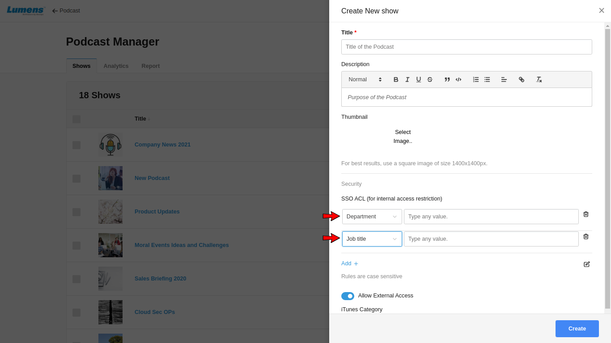
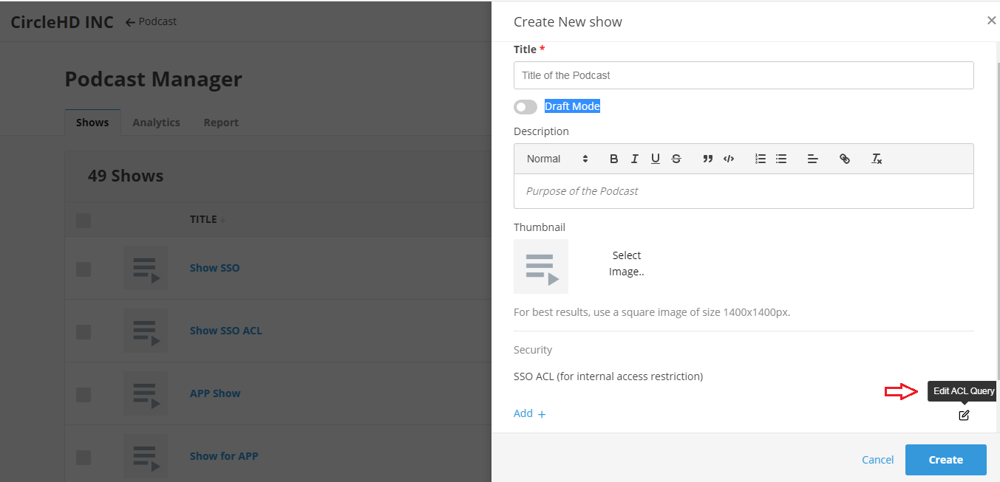
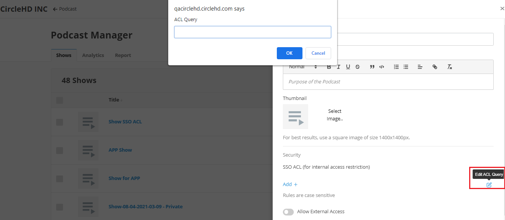

# How to secure a Podcast Show?

**ACL based Security \(SSO\)**

**i\) Using Email or SSO ACL**  
Adding an ACL \(access control lists\) will allow users to be added based on their SSO attributes stored by the enterprise SSO. Only privileged user will be able to browse the show. You can also secure by using Email option in the drop down to secure a Podcast Show.

Adding Department will give permissions to the users of the department to watch a show. Other attributes like Email, 'Job Title' , Manager, Cost Center, etc. will provide permission of the show to the users accordingly.

**ii\) Delete SSO ACL**  
User can delete unwanted ACL using delete icon. iii\) Edit ACL Query Click on edit icon to edit ACL query

**iii\) Edit ACL Query**  
Click on edit icon to edit ACL query

When click on edit ACL Query icon then it opens pop-up to add ACL query

