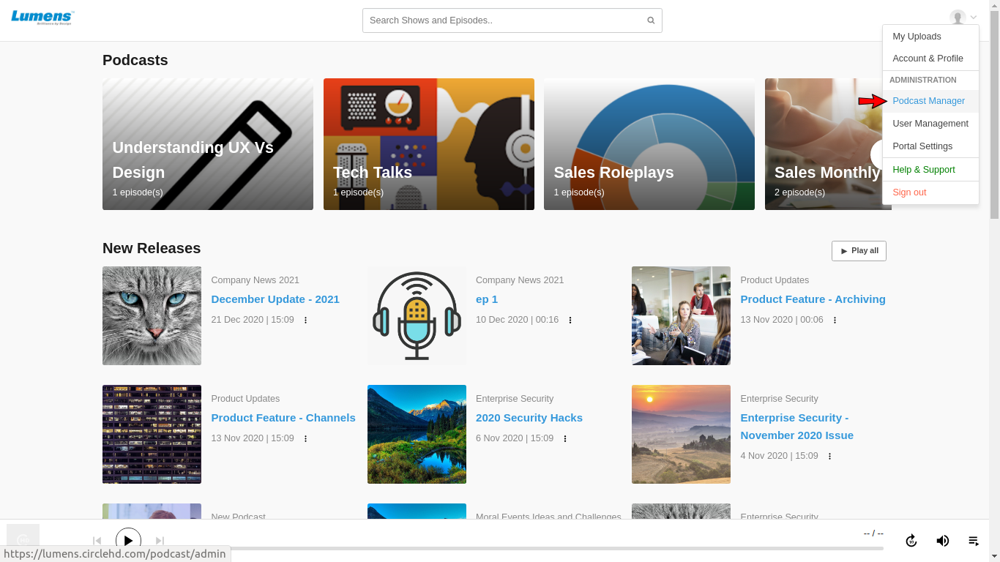

# How to view Podcast usage and analytics?

**1-** To open Podcast Manager page, click on the \[**Podcast manager**\] option in the top right drop-down menu.

**2-** Click on the Analytics tab on the Podcast Manager page.

**3-** Last one month analytics statistics is visible by default. User can change the date range to see desired statistics.

**4-** Admin can see the number of Shows, Episodes, Listeners and Plays created with in the selected date range.

Top 10 episodes pie chart data and Engagement of Episodes are also visible in graph format.

**5-** Each Episode and its Listerners' detail data is also available in the Analytics section.

### Podcast Custom Reports

**1-**  ****Click on the Report tab on the Podcast Manager page.

**2-**  ****Last one month **Report** is visible by default. User can change the date range to see desired statistics.

User can see the statistics of individual Podcast shows by using the Shows filter.

SImilarly based on date filter each podcast's detail data can be analyzed here.

User can download the report by clicking on the top right "Export" option.

