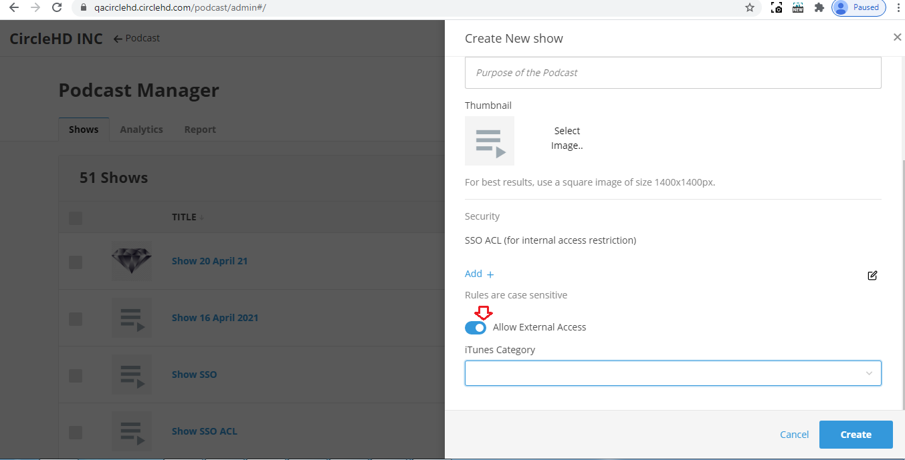
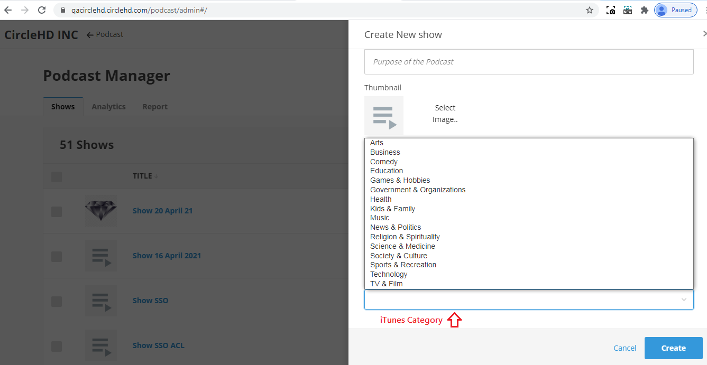
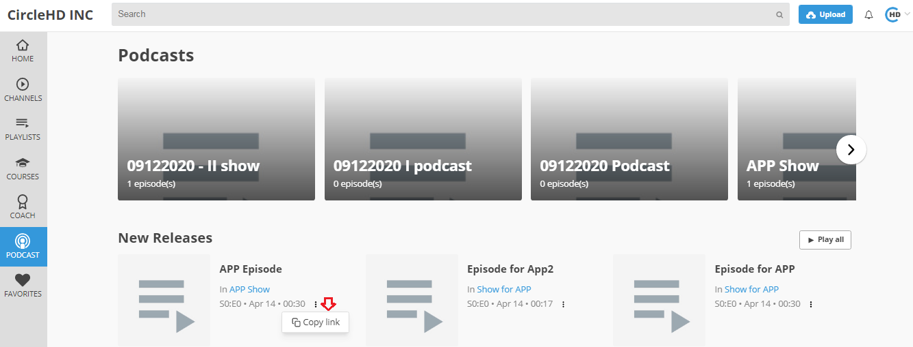

# How to share Podcast internally and externally?

i\) **Allow External Access -** It allows to share the link of the show with non registered users or external users outside of your organization. This way the episodes and shows can be shared with users who are not in the system as the shared link will not need authentication.

ii\) **i-tunes category** - User can select categories for show. If a show is created for education purpose or entertainment purpose, related category can be selected for the show.

iii\) **Using the Copy Link option:**

User can click on Copy Button to copy the link to Show or Episode and share it directly with another user either through email or chat. All users will need to login to view the content unless its enabled for external sharing.

To copy link, either open Podcast Manager.  
Click on top right menu &gt;&gt; Select \[Podcast manager\] option in the drop-down menu.

Shows list will get shown in Shows tab. When hover mouse on any show then 3 options will get shown-   
a. 3 Dots for COG dropdown from where we can copy link   
b. Edit show icon and   
c. To add episode

Click on 3 dots to see COG Dropdown to copy link

OR Click on Podcast option in the left vertical menu. 

It opens Podcast page. The top section displays all shows and all New Released Episodes are visible.

Click on 3 dots beneath the show name to coly link

iv\) **Using the Embed option:**

**a-** Click on embed code link, it will open pop-up to play episode and to copy embed code

**b-** When click on play icon, episode starts playing.

**c-** Click on copy embed code, it copied to clipboard.

**d-** To close the popup, click on close link.

