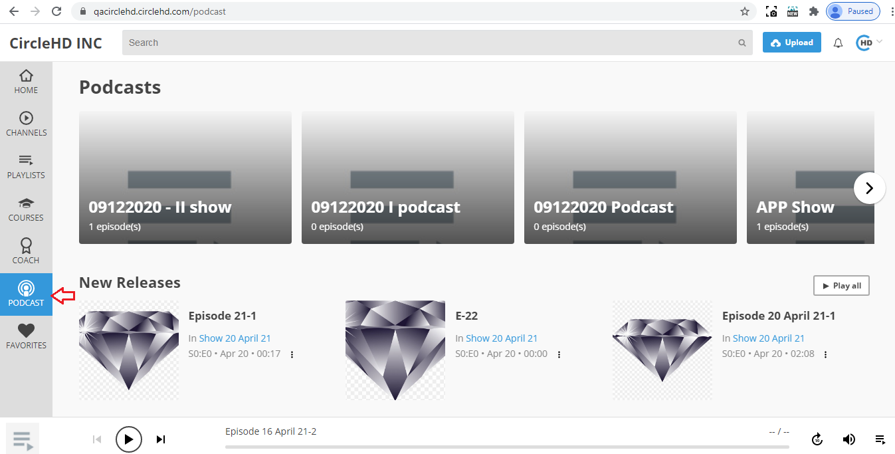
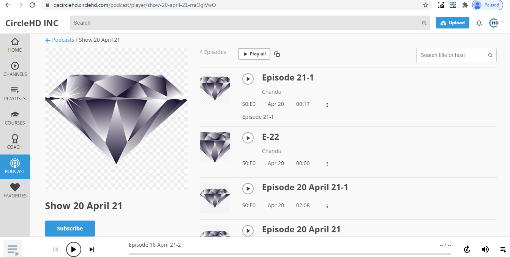

# How to subscribe to a Podcast Show?

1- Click on Podcast option in the left vertical menu.

2- It opens Podcast page. The top section displays all shows.

3- Click on a show to see the episodes list of the show.

4- Click on Subscribe button, show will get subscribed

