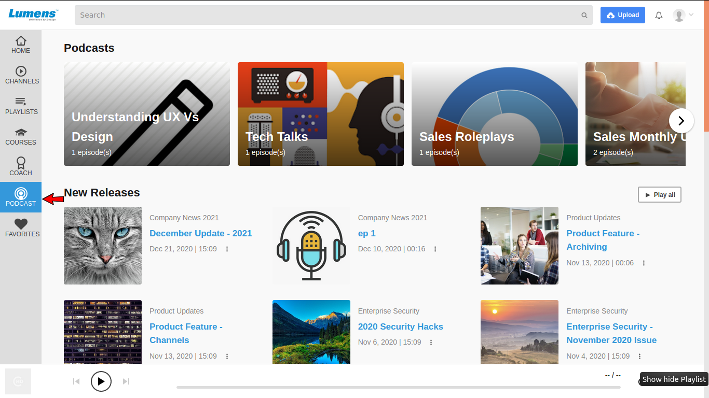
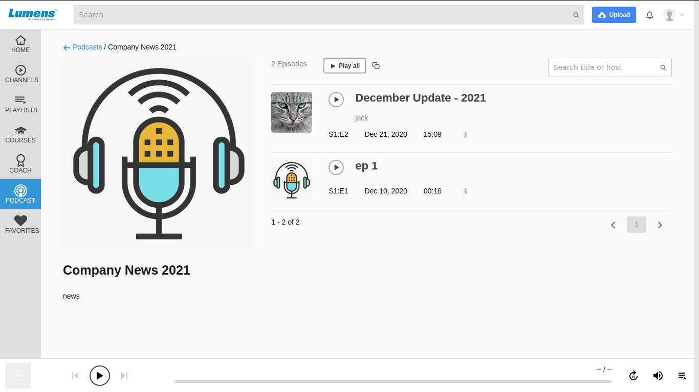
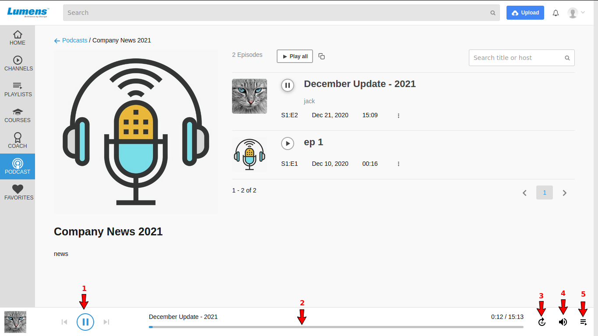
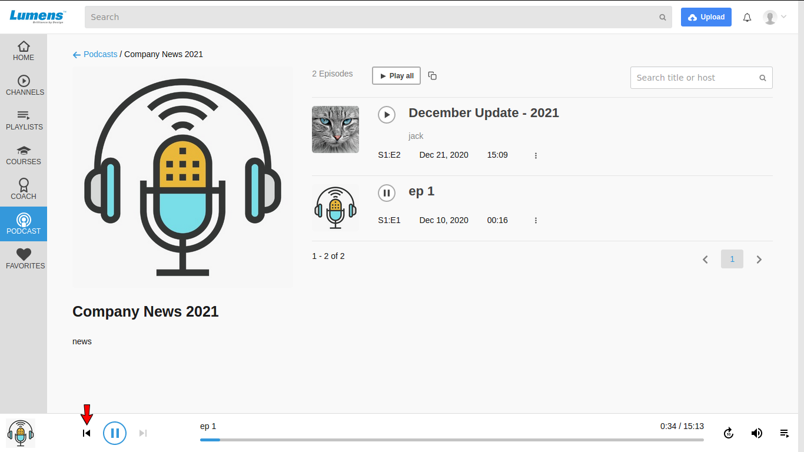
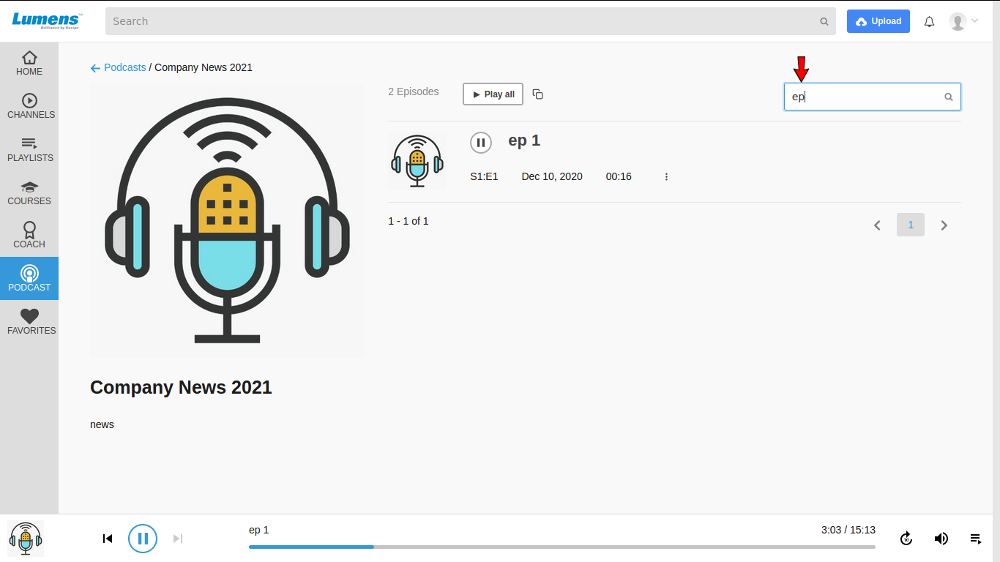
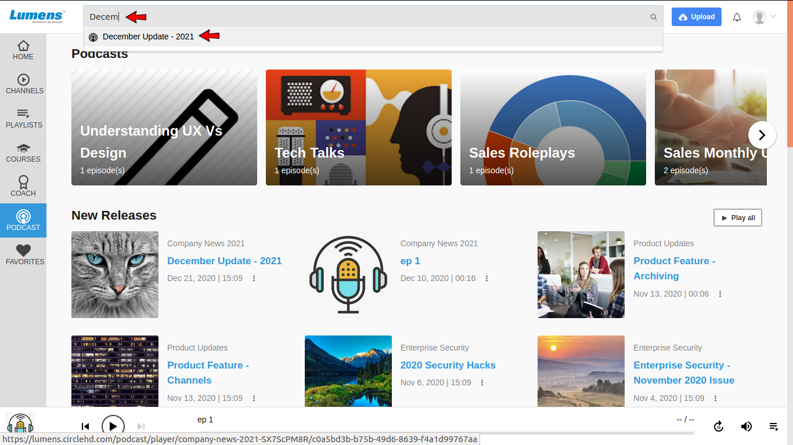
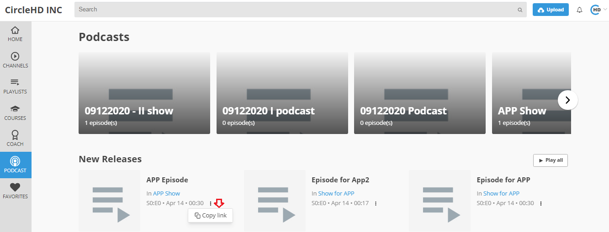
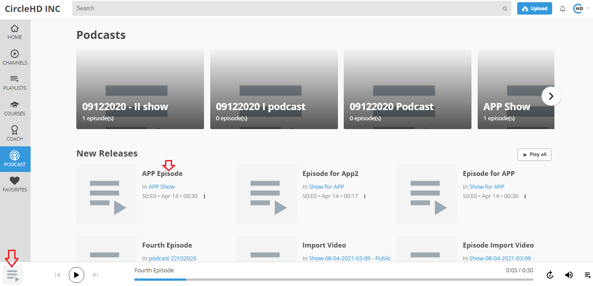
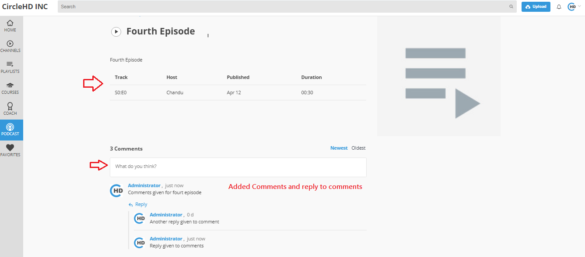

# How to navigate to a Podcast?

**1-** Click on Podcast option in the left vertical menu. This is in case you are using other features of the Video platform. If you are using just Enterprise Podcast Feature, then you will see Podcast Home page as default Home Page.  

**2-** It opens Podcast page. The top section displays all shows, 

and all New Released Episodes are visible.

**3-** Click on a show to see the episodes list of the show.

It lists all episodes of the show.

**4-** Click on the play button to listen an episode or click on 'Play All' to play all episodes of the show.

It opens audio player in the footer and starts playing your selected episode.

### Audio Player

**1- Play/Pause Button** - If episode is playing, it will pause the episode after clicking on the button.

**2- Progress Bar** - Clicking on progress bar location, it skips the audio and starts playling from the selected location.

**3-  Skip 10 seconds** - It is helpful to skip a audio of 10 seconds only.

**4- Volume** - It controls the volume.

**5- In-Progress List** - It lists the in progress episodes.

Next Option helps to play the next episode of the show.

SImilarly Previous Option plays the previous episode of the show.

**5-** Search box helps to search an episode within the show. If there are a lot of  episodes in the show, it helps users to filter based on titles.

**6-** To search a specific show or episode, you can use search option on Podcast Page.

Episode suggestions will start appearing once you start typing in the searchbox.

When you click on the suggestion, it takes you on the episodes list page where you can play the desired episode.

While searching a podcast episode or a show, you can see podcast icon with the suggestions to differentiate between other media and podcast.

**7- Copy Link**  
To copy show link, click on 3 dots then tool tip to copy link with icon will get shown and link will copied to clipboard. 

Text

When paste copied link on another tab or another browser then show with episodes associated with it will get listed.

**8- Add Comments for each episode**

To add comments for each episode availavle on podcast main page, please either click on episode name or on player option.

When click either on episode name or player icon then selected episode with details like, Track, Host, Published, Duration along with comment box will get shown.

\*\*\*\*

