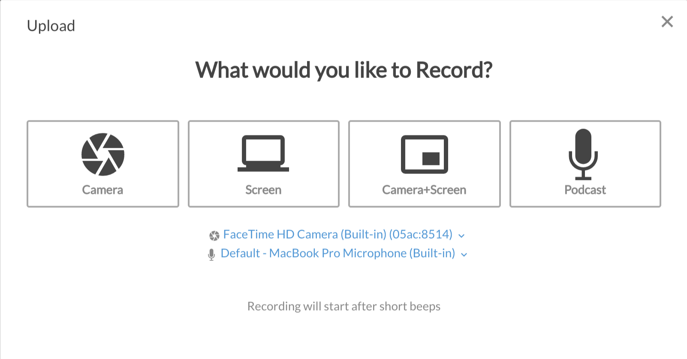

# Recording Screen + Camera \(Picture in Picture\) for effective training

1. Click on Record button in top right corner, that loads options for recording.

2. Select the appropriate option as needed. If you plan to share screen and record webcam same time, click on Camera+Screen option.   

3. On the next screen, select the screen you want to record and click on the docking window to set the camera location on screen.

4. Before starting to record, it will beep for 2 seconds. Once recording is complete, click on end recording or stop sharing to end the recording. 

5. It will load the preview screen, where user can edit the recording by trimming to micro seconds on start or end of the recording. 

 

6. Once recording is reviewed, click on Upload to upload to portal, or download button to download on your local machine.

