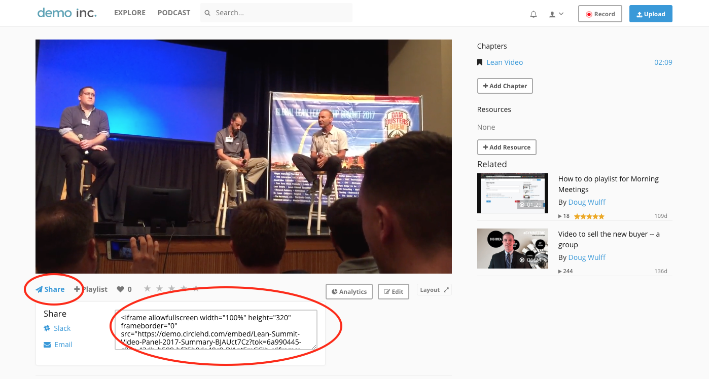

# Embedding Videos

## Embed Markup \(HTML\)

CircleHD supports embedding videos into other systems such as LMS, Wiki, Confluence and SharePoint. To get the embed markup click **sharing** below the video playback. 



  
The standard HTML Code looks like following.

```markup
<iframe allowfullscreen width="100%" height="320" frameborder="0" 
src="https://site.circlehd.com/embed/url?tok=xyz"></iframe>
```


 The height and width can be modified to match the target container. Default height 320 is too small in most cases should be replaced.


### Embedding on a trusted sites.

By default users must be logged in to watch on the embed. If you have a trusted site, and you don't like to force the users to log-in before watching, you can enable trusted site under portal settings.

Users accessing iframe based embedding from these domains will not be prompted to login. However, the username will not show up in analytics if they have not previously logged into CircleHD



If you have multiple domains, wildcard domain names can be added.


### Auto Playing Embedded Videos

Videos can be played automatically on page load by appending **\#autoplay=true** to the URL, like following.

```text
https://site.circlehd.com/embed/title#autoplay=true
```

### Starting Video at specific position

Videos can be played from a specific time by appending **\#t=seconds** to the URL like following. 

```text
https://site.circlehd.com/embed/title#t=100
```

In the example above the video will play from 100th second or 1 minute 40 seconds when played. The user may however can drag the progress bar to watch from an earlier position.


Note autoplay and start position can be used together like following


```text
https://site.circlehd.com/embed/title#autoplay=true&t=100
```

