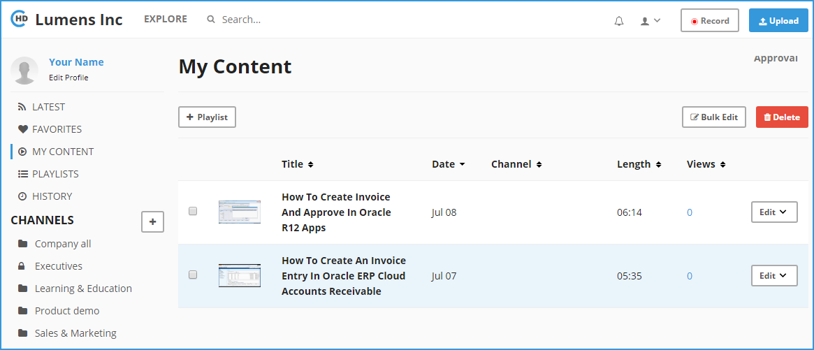
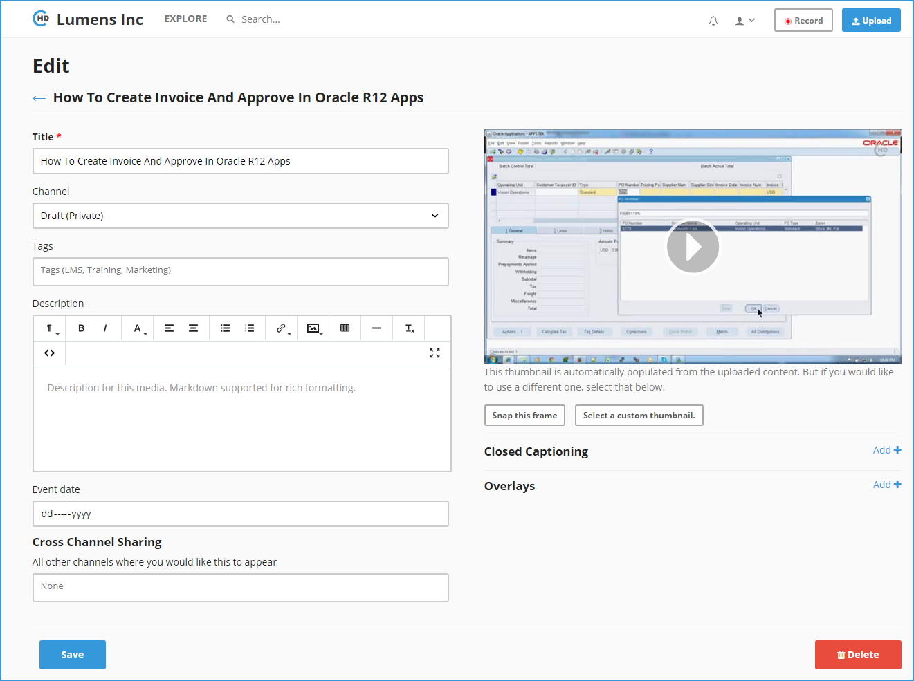

# How to Edit/Delete an Existing Video?

**1-** Click on “**My Content**” link in the left navigation menu.

**2-** It will display a list of all uploaded and recorded videos. 

**3-** Next to the video, there is Edit drop down, click on drop and select “**Edit**” option in the list.

**4-** Clicking on Edit option, takes you to the Edit page where you can update details related to the Video.

**5-** Please make sure you click “**Save**” once changes are complete. 

**6-** You can use this page to delete the Video as well, “**Delete**” button is available at the bottom right. 

**7-** You can use this edit page to assign the Video to a Channel, provide Search Tags, Description, Event Date \(in case video is related to an Event\), Product Type, Speaker and Presenter Name, customize Thumbnail, add Closed Captioning, add Overlays, add this video to multiple channels.

