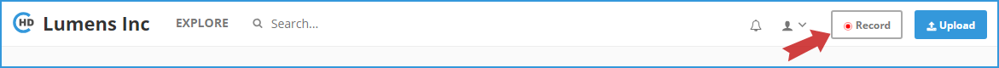
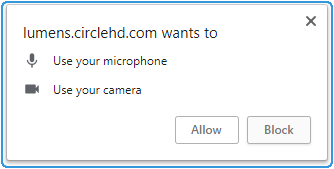
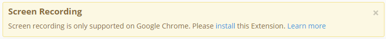
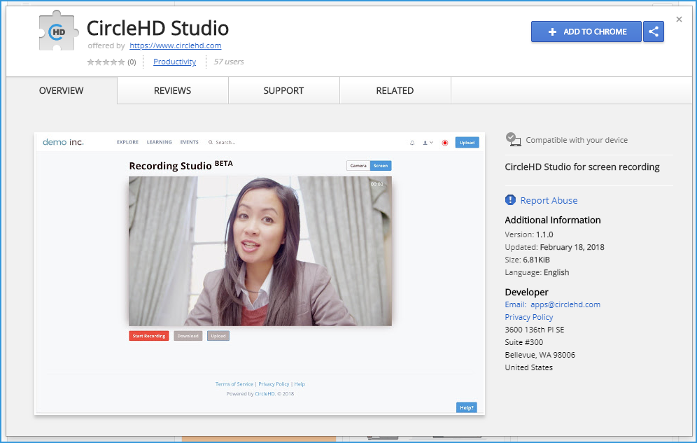
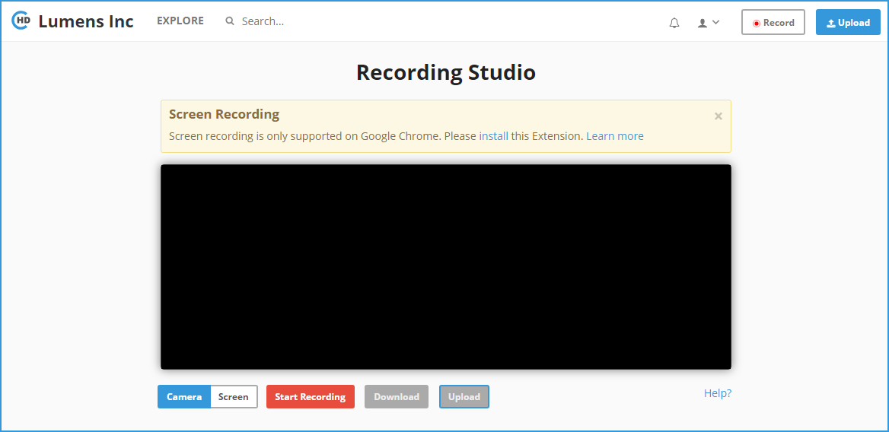
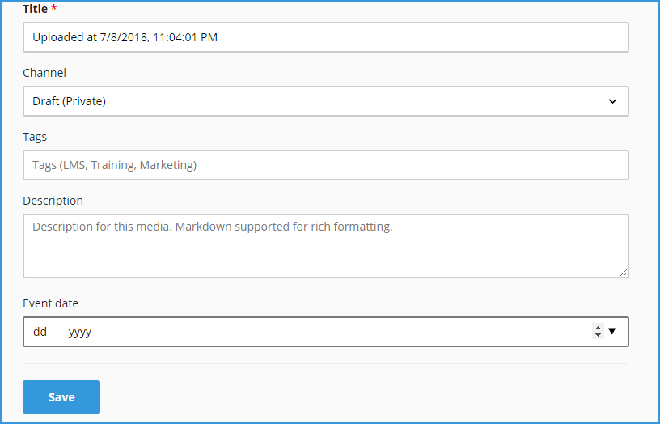
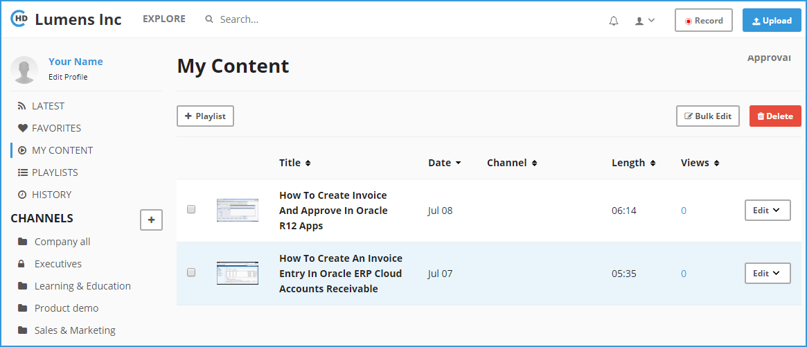

# How to Record a New Video?

**1-** Click on the “**Record**” button in the top right.

**2-** You may be asked to grant the permission to use your camera and microphone to the system, click "**Allow**" to continue.

**3-** You may also need to install the "**CircleHD Studio**" extension on your chrome browser.

Click on the "**ADD TO CHROME**" button to install the "**CircleHD Studio**" extension.

**4-** The **Recording Studio** will be opened and your Camera and microphone will start automatically.

**5-** The Recording Studio goes to the webcam camera recording option by default, you can click on “**Camera**” button below the Video player to make sure it’s selected. 

**6-** Then click on “**Start Recording**” to start the session, it will countdown from 3 to provide lead start. 

**7-** Once you have recorded the video, you can click “**Stop Recording**”. 

**8-** You will be able to review the recording by playing on Video player controls, which are similar to CircleHD Video player. 

**9-** Once you review the recording, you can chose to upload the video to CircleHD portal by clicking on “**Upload**” button below the Video player.

**10-** Enter the details for the recorded video, assign this directly to a Channel or keep it in Draft \(Private\) Channel if this needs to go through revisions. 

**11-** Add Tags, Description and Event Date if applicable. Click on the "**Save**" button to save all your changes. 

**12-** If you need to retake the Video, then you can click on “**Start Recording**” again to ignore the earlier recording and start again. 

**13-** Make sure you click on “**Save**” once you enter all the data for the recording. 

**14-** You can click on “**Download**” to download a copy locally, which you can edit as needed and upload it using the standard “Upload” option in the portal. 

**15-** The recorded videos will be listed in "**My Content**" page.

