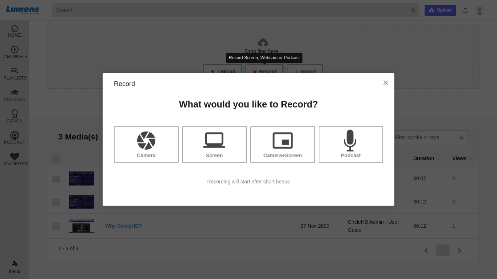
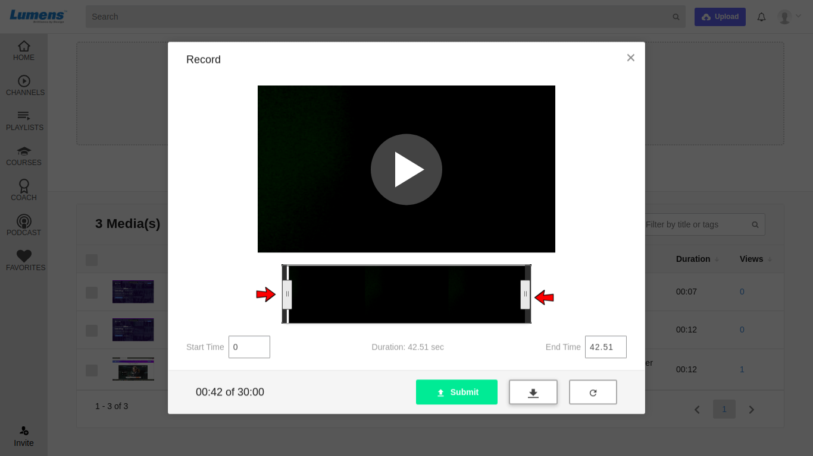

# How to Record a New Video?

**1-** Click on the “**Upload**” button in the top right.

**2-** Select **Record** option to record and upload the video.

**3-** Following Record options appear.

**a- Camera** - Browser asks permission to allow mic and camera. Once permission is given, it starts recording.

Clicking on **Camera** option starts the recording, it will countdown from 3 to provide lead start. 

User can also **Pause** the recording using **Pause** button. Pause icon turns into Play icon and clicking on Play icon starts the recording again from the point where you stopped it.

**End Recording** option ends the recording and another pop-up appears for final submission.

Here user can cut the video using the slider options mentioned in above image.

Once user is ready to Submit recorded video, he/she can click on Submit button for final submission.

Recorded video starts uploading, user can update the video details by clicking on edit option.

A form appears where user can update the video details.

1. Title
2. Description
3. Channel
4. Tags

Make sure you click on “**Save**” once you enter all the data for the recording. 

Once the video is processed successfully, it starts appearing in **My Uploads**.

Similarly other record options work.

**b- Screen** - It records the activity with voice. If user wants to perform certain action on the device, Record screen option records the activity with voice.

**C- Camera + Screen -** It records the activity with camera.  User can provide instructions with camera as well as it records the activity too.

Camera appears at bottom right corner in "Picture in Picture" format.

The functionality is not available on Mozilla Firefox. 

**d- Podcast -** The option records audio. Uploaded audio can be seen on **My uploads** page.

