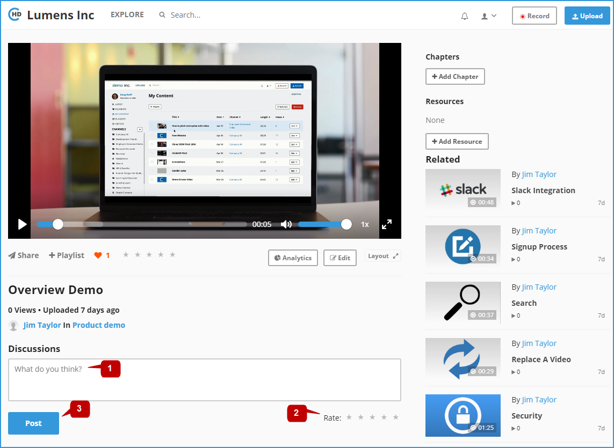

# How to Post Discussion And Rating?

Portal users can share their thoughts on a video through the discussion panel:

**1-** You can add your comments for the video in the "**Discussions**" area. 

**2-** **Rate** the video using the scale rating. 

**3-** Click on the "**Post**" button to save the discussion information.

