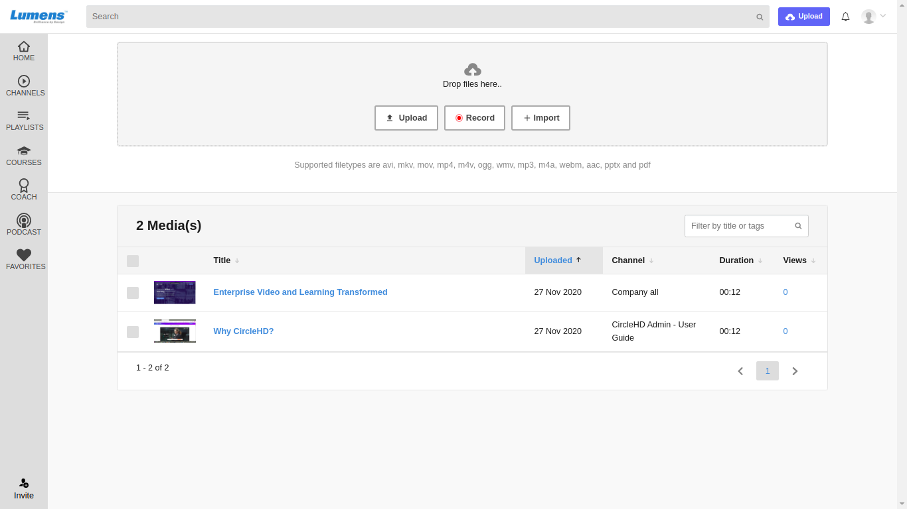
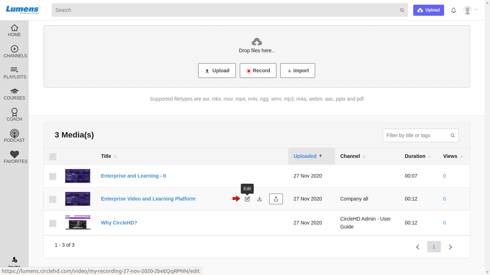
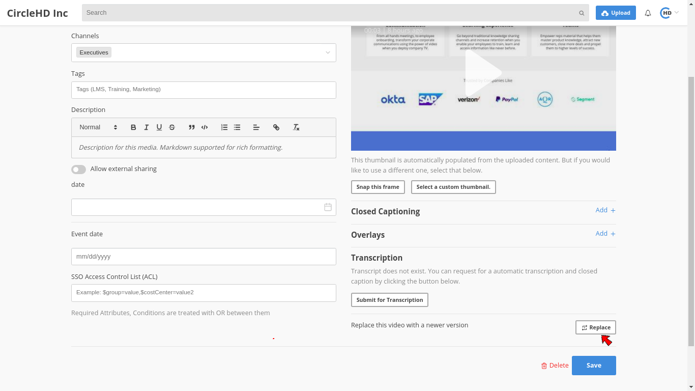
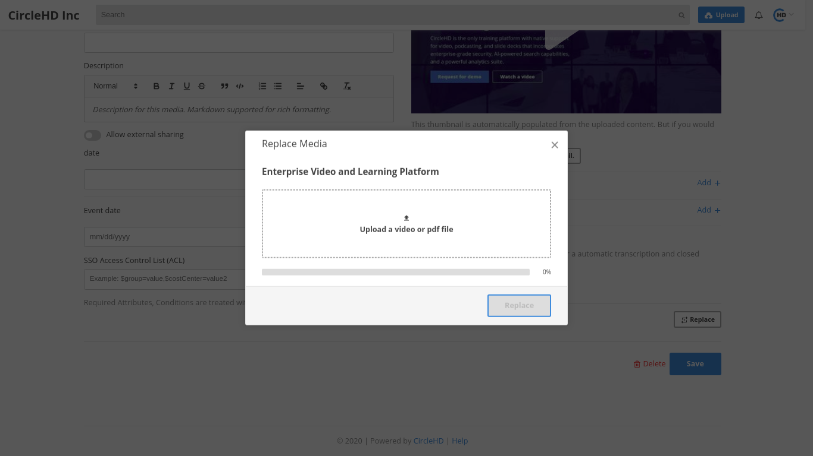

# How to replace an existing video?

**1-** Click on “**My Uploads**” link in the top menu.

**2-** It will display a list of all uploaded and recorded videos. 

**3-** Next to the video, there is Edit option.

**4-** Clicking on **Replace** option, loads a popup form where you can upload a new video to override the existing video. 

**5- C**lick “**Replace**” once upload is complete. 

