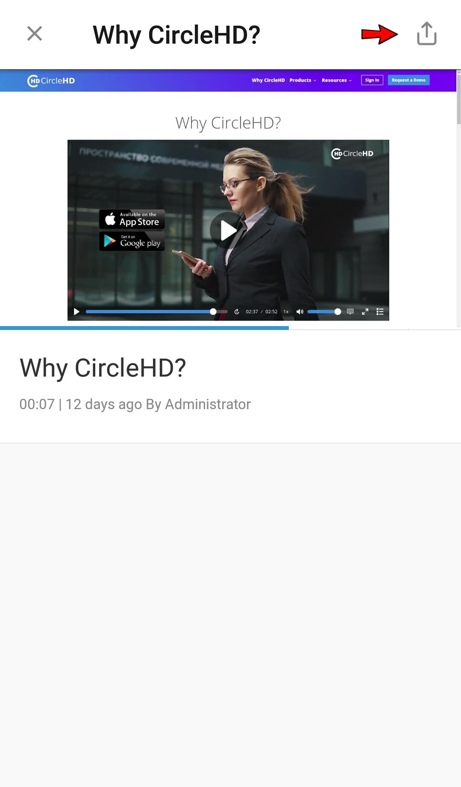

# How to Share a Video?

You can share a Video by clicking on “**Share**” link below the Video on the left. You can share the embed HTML script, or send the same using Slack or Email option.

### Mobile

**1-** Play the video you want to share. It ****opens **View Page** of the video.

**2-** Touch the share icon at top right corner.

**3-** It provides various options of sharing including facebook, whatsapp, and other social networking sites which are installed on your device.

a. If External Sharing option is enabled for the video, it can be shared in various platforms and users can see the video with logging into th application.

b. If External Sharing option is not enabled, still video can be shared but only authorized user can watch it.

