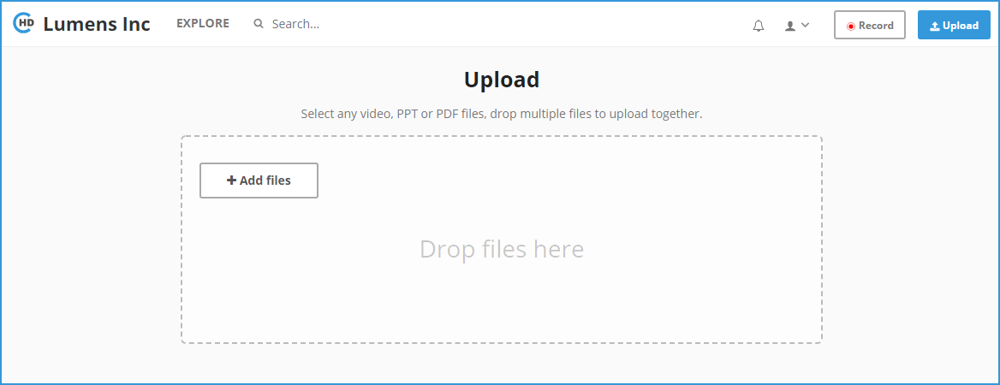
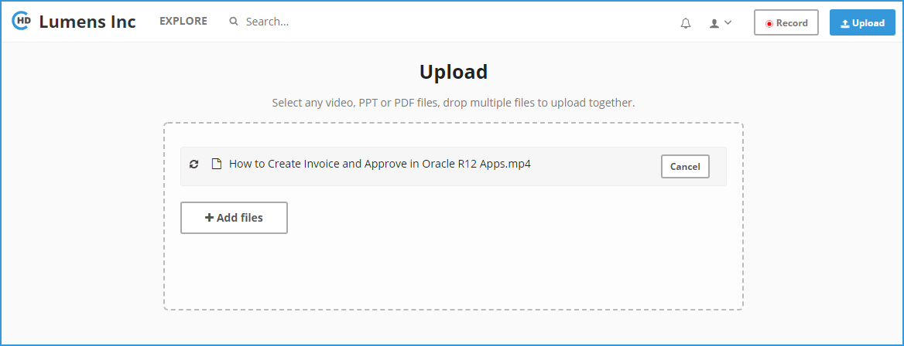
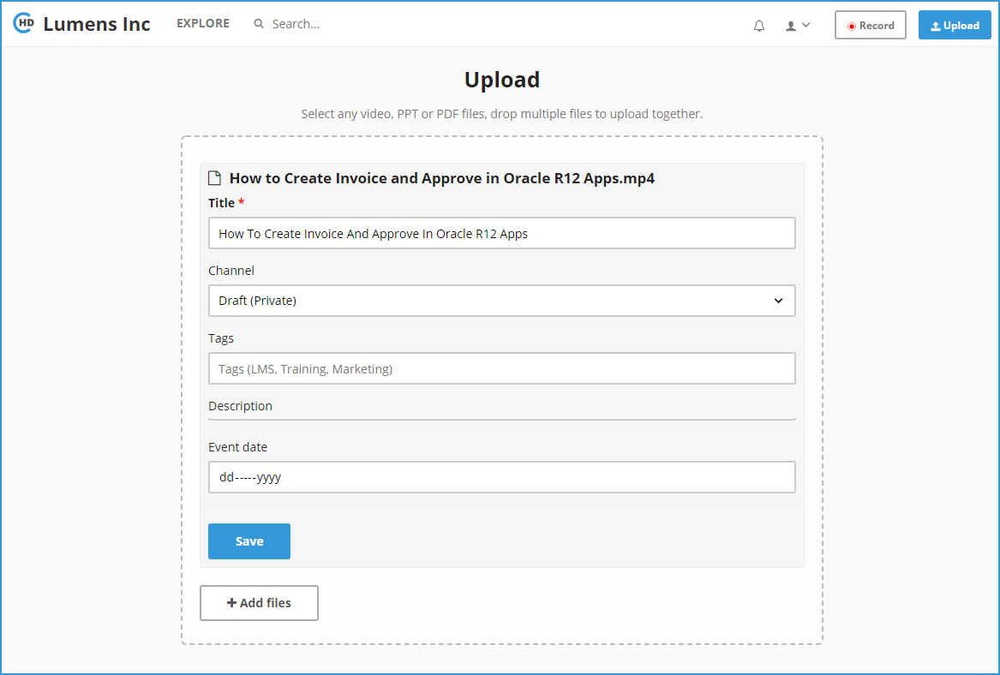

# How to upload a Video?

**1-** Click on the “**Upload**” button in the top right.

**2-** It will take you to the Upload page.

**3-** Click on the "**+ Add Files**" button and select any video, PPT or PDF files, drop multiple files to upload together. 

**4-** The upload process will start as soon as you add the files.

**5-** Once uploading is complete, the below file details form will appear.

**6-** Enter the details for the uploaded Video or Content file \(PDF, PPT\). You can assign this directly to a Channel or keep it in Draft \(Private\) Channel if this needs to go through revisions. 

**7-** Add Tags, Description and Event Date if applicable. Click on the "**Save**" button to save all your changes. 

**8-** You can add more Videos by clicking on “**+ Add Files**” button. 

**9-** The uploaded videos will be listed in "**My Content**" page.

