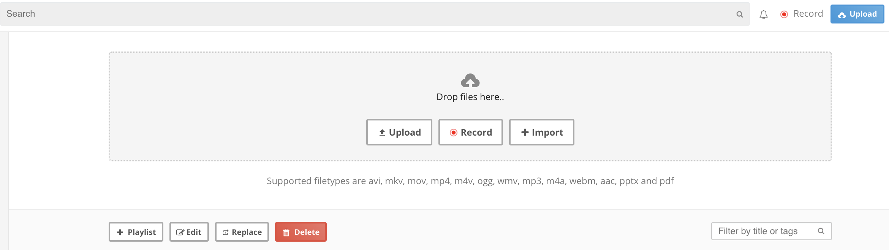

# Import Video, Media or Content from External Sources into CircleHD Portal

Import option in CircleHD is a very powerful feature which allows you to get a lot of medias and videos from external sources. 

To use import option, please follow below steps;

Step 1: Click on Upload in the top right or go to My Uploads

Step 2: Click on Import button, this will ask user to enter the import url. If you know the Video / media share url, you can enter that directly or copy the browser url and paste in URL box. 

Step 3: You can select main channel if required, click Add once done. This will create a regular video, media item within the portal after importing.

Once its imported successfully, it can be shared across multiple channels or other employees, users. It can import around 250 different sources of content, including all media types.The supported list is shown below.if you have any questions, please feel free to email support@circlehd.com   

> _23HQ, Adways, Alpha App Net, Altru, amCharts Live Editor, Animatron, Animoto, Apester, Archivos, AudioClip, Audiomack, AudioSnaps, Backtracks, Beautiful.AI, Blackfire.io, Box Office Buz, BrioVR, Buttondown, Byzart Project, Cacoo, Carbon Health, CatBoat, Ceros, ChartBlocks, chirbit.com, CircuitLab, Clipland, Clyp, CodeHS, Codepen, Codepoints, CodeSandbox, CollegeHumor, Commaful, Coub, Crowd Ranking, Cyrano Systems, Daily Mile, Dailymotion, Deseretnews.com, Deviantart.com, Didacte, Digiteka, Dipity, DocDroid, Dotsub, DTube, edocr, eduMedia, EgliseInfo, Embed Articles, Embedly, Ethfiddle, Eyrie, Facebook \(Post\), Facebook \(Video\), Fader, Faithlife TV, FITE, Flat, Flickr, Flourish, Fontself, FOX SPORTS Australia, FrameBuzz, FunnyOrDie, Geograph Britain and Ireland, Geograph Channel Islands, Geograph Germany, Getty Images, Gfycat, Gifnote, GIPHY, GloriaTV, GT Channel, Gyazo, hearthis.at, HuffDuffer, Hulu, iFixit, IFTTT, Indaco, Infogram, Infoveave, Injurymap, Inoreader, inphood, Instagram, iSnare Articles, Issuu, ivlismusic, KakaoTv, Kickstarter, Kidoju, Kijk, Kit, Kitchenbowl, Knacki, LearningApps.org, Lille.Pod, Livestream, Ludus, MathEmbed, Matterport, me.me, Medienarchiv der Künste - Zürcher Hochschule der Künste, Meetup, MixCloud, Moby Picture, Modelo, MorphCast, Music Box Maniacs, myBeweeg, nanoo.tv, Nasjonalbiblioteket, nfb.ca, Odds.com.au, Official FM, Omniscope, On Aol, Ora TV, Orbitvu, Oumy, Outplayed.tv, Overflow, Pastery, PingVP, Pixdor, Podbean, Poll Daddy, Port, Portfolium, Quiz.biz, Quizz.biz, RapidEngage, Reddit, ReleaseWire, Replit, RepubHub, ReverbNation, RiffReporter, Roomshare, RoosterTeeth, Rumble, Sapo Videos, Screen9, Screencast.com, Screenr, ScribbleMaps, Scribd, SendtoNews, ShortNote, Shoudio, Show the Way, actionable location info, Simplecast, Sizzle, Sketchfab, SlideShare, SmugMug, SocialExplorer, Songlink, SoundCloud, Soundsgood, SpeakerDeck, Spotful, Spotify, Spreaker, Stanford Digital Repository, Streamable, StreamOneCloud, Sutori, Sway, Ted, The New York Times, They Said So, TickCounter, Toornament, Topy, Tuxx, tvcf, Twitch, Twitter, Ubideo, University of Cambridge Map, UOL, Ustream, Utposts, Uttles, VeeR VR, Verse, VEVO, VideoJug, Vidlit, Vidmizer, Vidyard, Vimeo, Viziosphere, Vlipsy, VLIVE, Vlurb, VoxSnap, wecandeo, Wiredrive, Wistia, Inc., wizer.me, Wootled, WordPress.com, Yes, I Know IT!, YFrog, YouTube, ZnipeTV, ZProvider, Namchey, Natural Atlas, posiXion, SmashNotes, TypeCast, Audioboom, Blogcast, Facebook, OZ, Polaris Share, Typlog, uStudio, Inc. Collapse_

