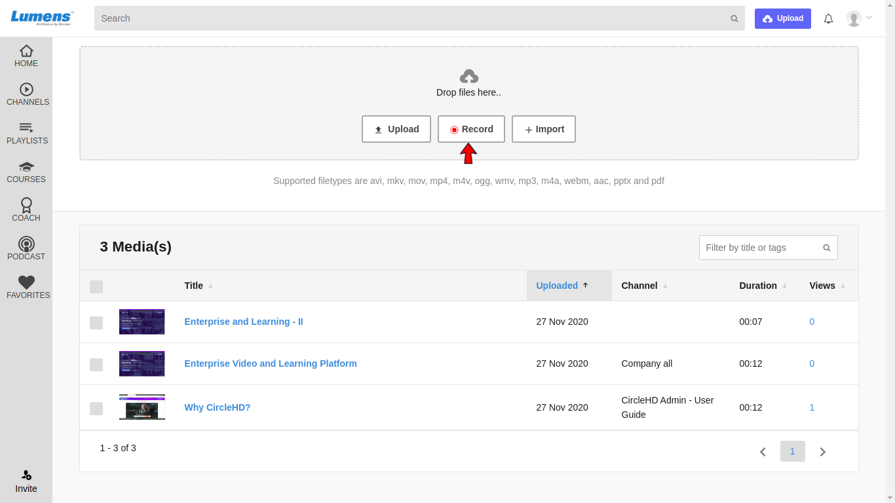
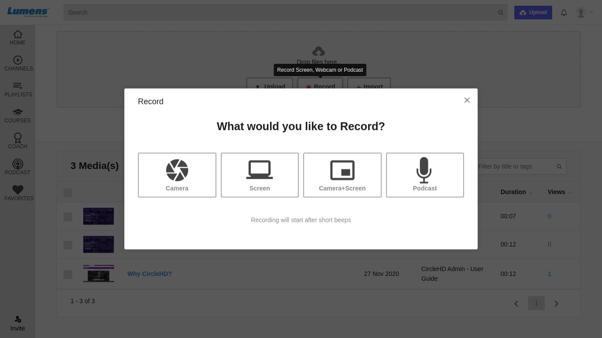
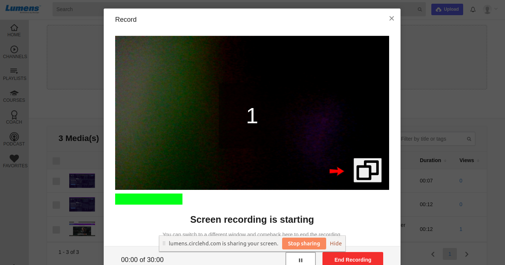
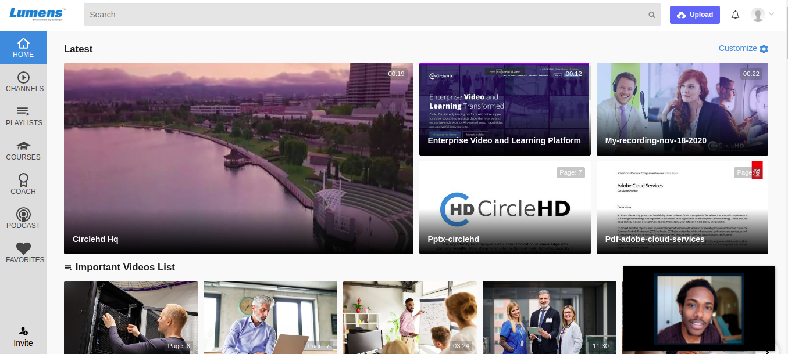
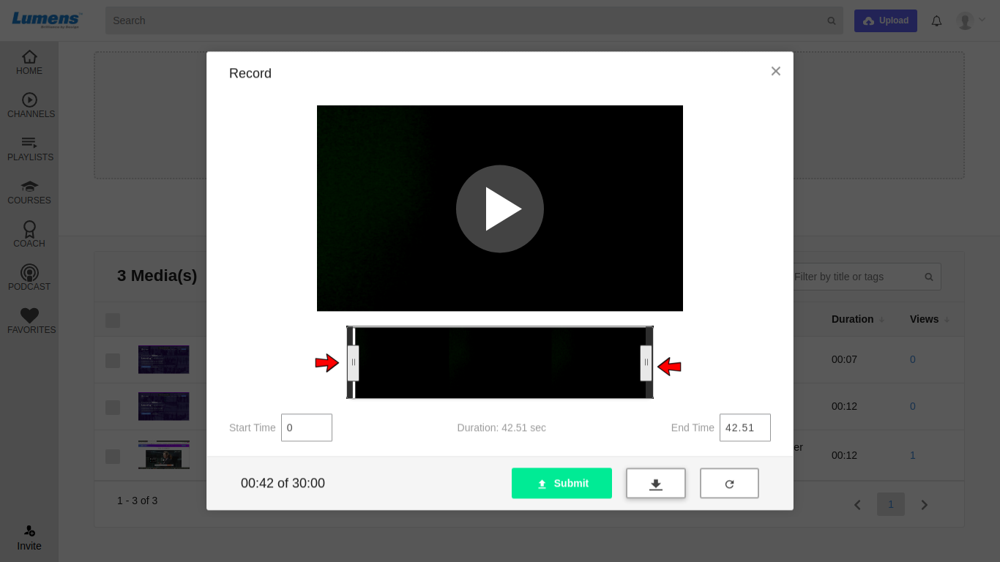

# Recording Screen + Camera \(Picture in Picture\) for effective training

**1-** Click on the “**Upload**” button in the top right.

**2-** Select **Record** option to record and upload the video.

Following Record options appear.

**3-** Select the appropriate option as needed. If you plan to share screen and record webcam same time, click on **Camera+Screen** option.   

**4-** Clicking on **Camera+Screen** option starts the recording, it will countdown from 3 to provide lead start. 

**5-** Clicking on Picture-in-Picture option makes Camera available at bottom right corner.

**6-** This helps a lot when user wants to show activity with camera.

**7-** User can also **Pause** the recording using **Pause** button. Pause icon turns into Play icon and clicking on Play icon starts the recording again from the point where you stopped it.

**8- End Recording** option ends the recording and another pop-up appears for final submission.

**9-** It will load the preview screen, where user can edit the recording by trimming to micro seconds on start or end of the recording.

**10-** Once user is ready to Submit recorded video, he/she can click on Submit button for final submission.

